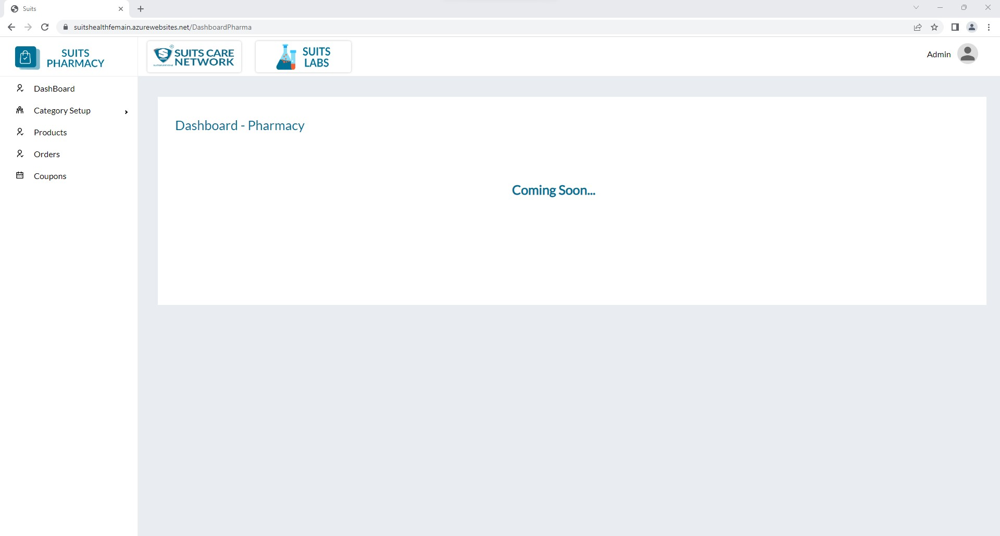
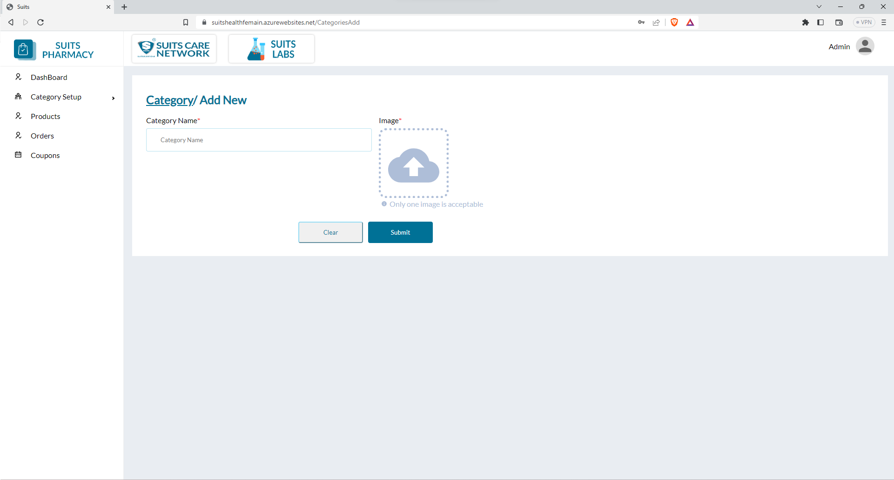

# Category Management

Upon observing the website, it appears that there are two additional logos apart from the main logo. Clicking on these logos will direct users to their respective pages.

If a user clicks on the "Suits Pharmacy" logo, they will be redirected to the dashboard. The dashboard is a centralized page that provides an overview of relevant information, statistics, or functionalities related to Suits Pharmacy. It serves as a hub for managing and monitoring various aspects of the pharmacy's operations, such as inventory, sales, analytics, and other relevant data.

By accessing the dashboard through the "Suits Pharmacy" logo, users can conveniently navigate and access the specific tools, reports, or features provided by the pharmacy's website to aid in their day-to-day tasks or decision-making processes.

## All Category List

Within the Category Setup section of the website, there are options to manage both categories and subcategories. Clicking on any of these options will lead users to their respective pages, where they can view the list of categories.

Upon reaching the category page,admin , will have the ability to search for specific category names. This search functionality allows the admin to enter a category name of interest and quickly retrieve the corresponding category from the list.

Furthermore, users can filter the categories based on their status, which can be classified as "Active" or "Inactive." This filtering feature enables users to refine the displayed categories based on their status preference. By selecting the desired status filter, the list will be adjusted accordingly, showing only the categories that match the chosen status (e.g., active or inactive).

These search and filter options provide the admin with efficient means to locate specific categories and navigate through the category setup section with ease.

## Add New Category

By clicking on the "Add new category" option, you will be able to create a new category by providing its name and adding an image.

When you select the "Add new category" option, a form or a dialog box will likely appear, prompting you to enter the necessary details. In this form, you can enter the name of the category you want to create. This name should accurately represent the category you are adding.

Additionally, you will have the option to add an image to the category. This can be done by either uploading an image file from your device or selecting an image from a predefined set of choices. The image you choose will serve as a visual representation or icon for the category, enhancing its identification and recognition.

By providing both the name and image for the new category, you can effectively add it to the category list or hierarchy within the system. This allows for proper categorization and organization of items, products, or any other relevant data associated with that particular category.

## Delete Category

Within the category management section, you have the ability to delete any category using the delete icon.

When you locate the category you wish to delete from the list, you can click on the associated delete icon. By clicking on this icon, you initiate the deletion process for that particular category. The system will prompt you to confirm the deletion to ensure that it is intentional.

Once you confirm the deletion, the category will be permanently removed from the system. It's important to note that deleting a category will also delete any associated data or records tied to that category. Therefore, exercise caution when deleting categories to avoid unintended consequences.

By utilizing the delete icon, you can effectively manage and remove unwanted or no longer needed categories from the system, maintaining a streamlined and up-to-date category structure.

