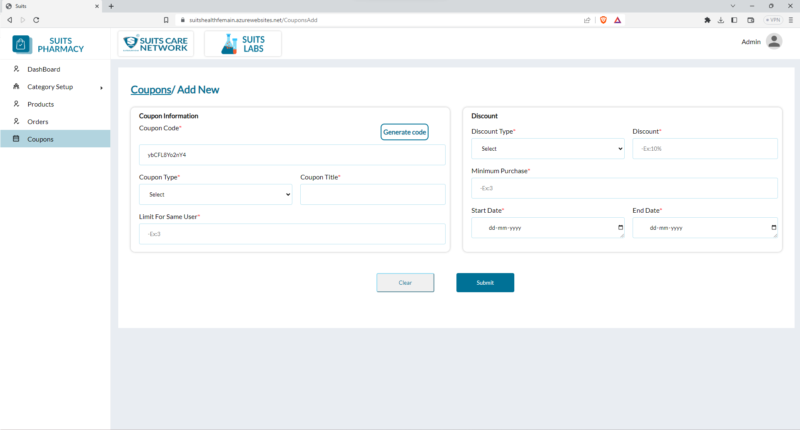

# Coupon Management

## All Coupon List

The admin has the capability to access the Coupons list, which contains various details about each coupon. These details include the Coupon Code, Coupon Name, Coupon Type, Discount Type, Duration, User Limit, and Status.

The admin can utilize the filter option to refine the displayed coupons based on their status. By selecting the "Active" or "Inactive" filter, the admin can view only the coupons that match the chosen status. This filtering feature streamlines the process of managing and analyzing coupons based on their current status.

In summary, the admin can view the complete Coupons list, comprising essential information such as coupon code, name, type, discount type, duration, user limit, and status. Additionally, they can apply a filter to display coupons based on their active or inactive status, ensuring convenient administration and control over the available coupons.

## Add New Coupon

The admin can add a new coupon by clicking on the "Add New Coupon" button.

Upon selecting the "Add New Coupon" button, the admin will be directed to a page or a form specifically designed for creating a new coupon. On this page, the admin will be prompted to provide various details and settings for the coupon.

These details typically include:

- Coupon Code: Enter a unique code that customers can use to apply the coupon during checkout.

- Coupon Name: Provide a descriptive name or title for the coupon.

- Coupon Type: Specify the type of discount or offer the coupon provides, such as a percentage discount, fixed amount discount, free shipping, etc.

- Discount Type: Choose whether the discount is applied as a percentage or a fixed amount.

- Duration: Set the start and end dates for the coupon's validity period.

- User Limit: Optionally, specify a maximum number of times the coupon can be used per user.

- Status: Determine whether the coupon is initially enabled or disabled.

Once the admin fills in these details and configures the coupon settings as desired, they can save the new coupon by clicking the "Save" or "Add Coupon" button. The coupon will then be added to the system and made available for customers to use during their purchases.

By using the "Add New Coupon" button, the admin can conveniently create and introduce new discount offers or promotional campaigns to attract and reward customers.

## Delete Coupon

The admin has the ability to delete a coupon by clicking on the delete icon associated with that particular coupon.

When the admin locates the coupon they wish to remove from the list, they can click on the delete icon linked to that coupon. By clicking on this icon, the admin triggers the deletion process for that specific coupon.

Typically, a confirmation prompt will appear to ensure that the deletion is intentional and to prevent accidental removal of the coupon.

Once the admin confirms the deletion, the coupon will be permanently removed from the system. This action also includes the removal of any associated data or records tied to that coupon.

It's important to exercise caution when deleting a coupon, as the process is irreversible, and the data cannot be easily recovered unless there are backups or archival systems in place.

By utilizing the delete icon, the admin can effectively manage the coupons and remove any outdated, expired, or unnecessary coupons from the system, ensuring a streamlined and up-to-date coupon list.

