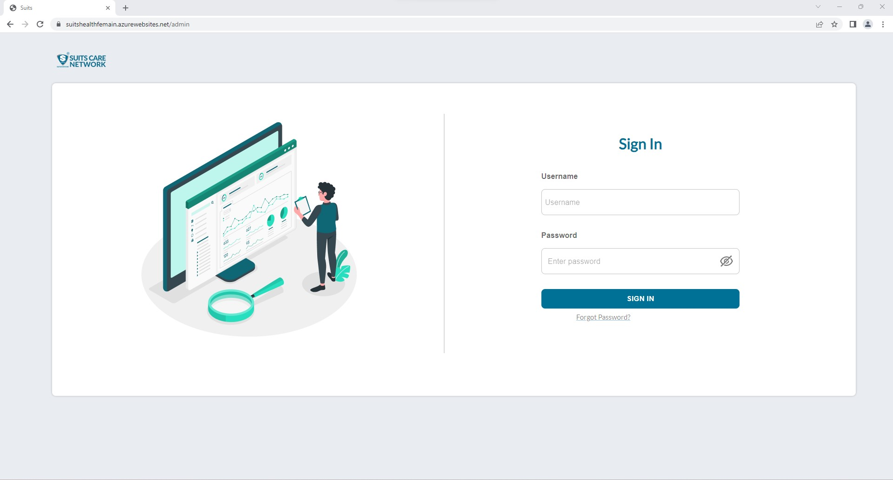
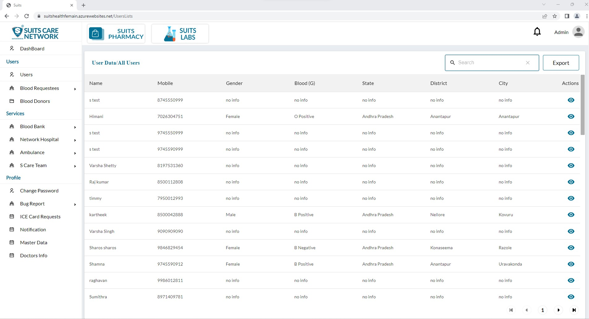
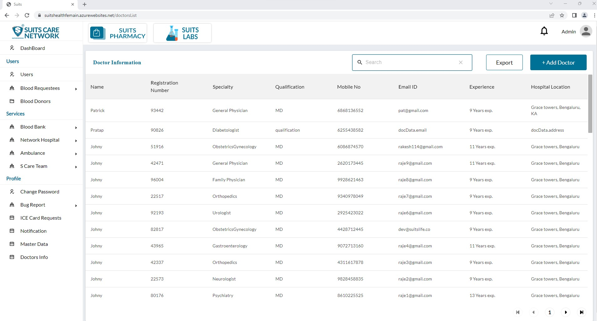
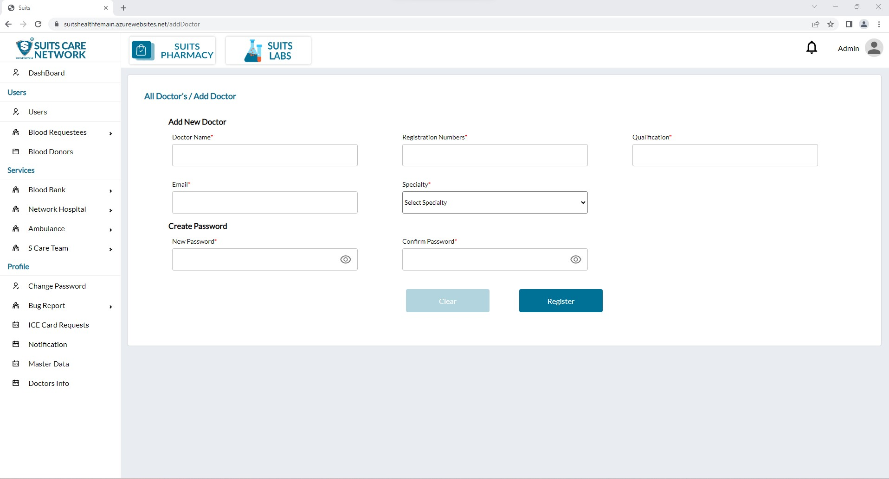

# Register Doctor

## Admin Login

Please click on [this site](https://suitshealthfemain.azurewebsites.net/admin) to get access for Admin Login

After successfully logging into the system with the correct combination of username and password, the admin will be granted access to the admin dashboard. Within the dashboard, the admin will find a sidebar menu.

From the sidebar menu, the admin can select the "Doctors Info" option. Upon clicking on it, a new page will open, displaying the details of registered doctors.

Look for an option or button to add a new doctor or create a new account. It may be labeled as "+Add Doctor".

Click on the "Add Doctor" to initiate the process.

A form or set of fields will appear, prompting you to enter the necessary details for the new doctor. Fill in the mandatory details. Once you have entered the mandatory information, review the form to ensure accuracy.

Click on the "Submit," "Save," or equivalent button to add the new doctor's login credentials and information to the system.
