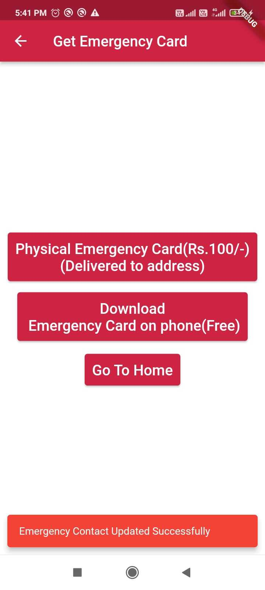
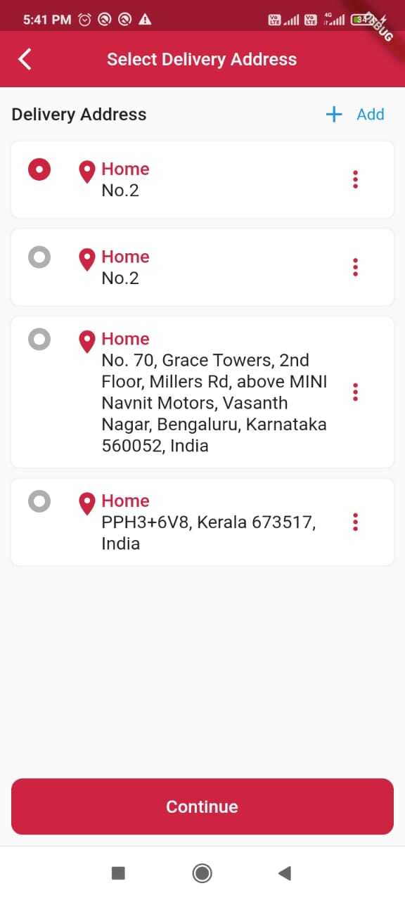
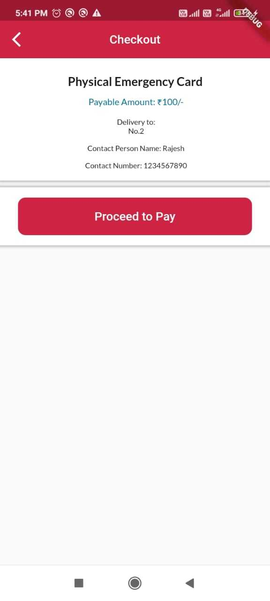
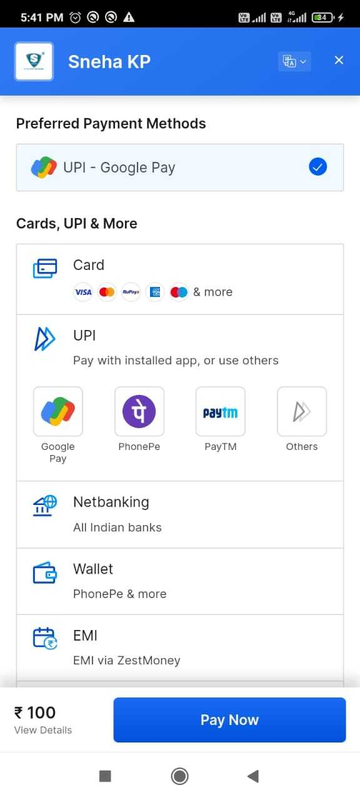
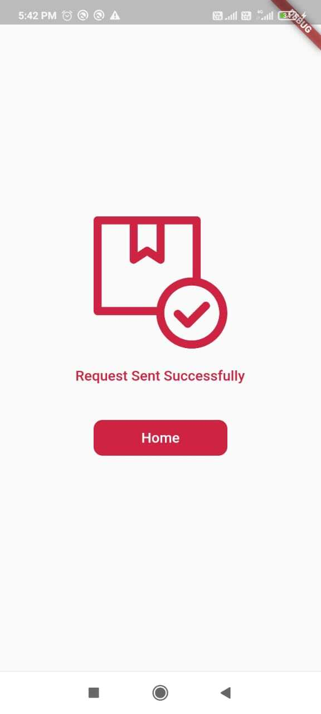

# Get Physical Card

User can Request For Physical Emergency Card Through Suits App

1. Click On Physical Emergency Card From the Above Page

2. User Can Able to Select Or add Their Delivery Address

3. Once Clicks On Continue, Navigate into CheckOut Screen, Where User Can review the details.

4. Everything Look Correct User can click on Proceed to Pay, User Will Navigate into payment page where user will able to make the payment.

5. Once the payment is success, user will able to see the below page from where the user can able to navigate into home page.

