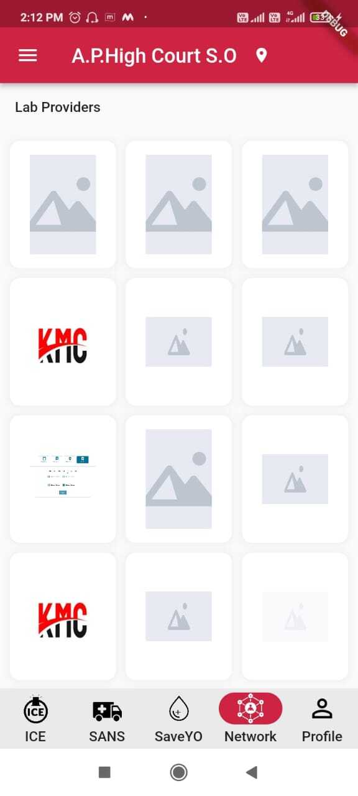
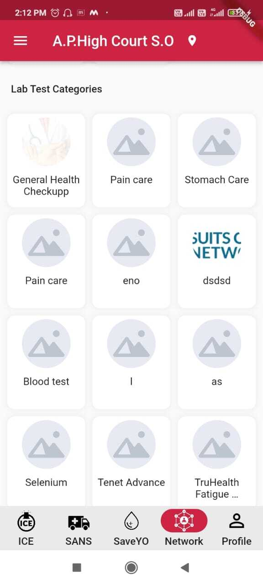
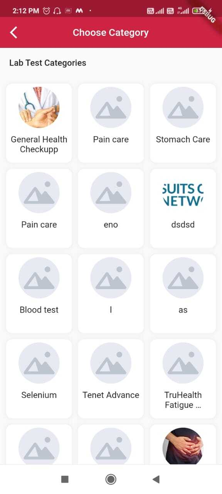
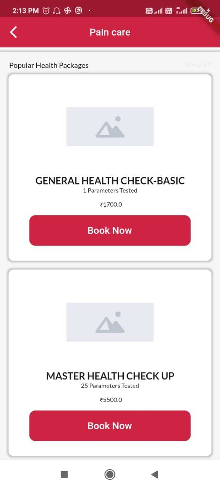
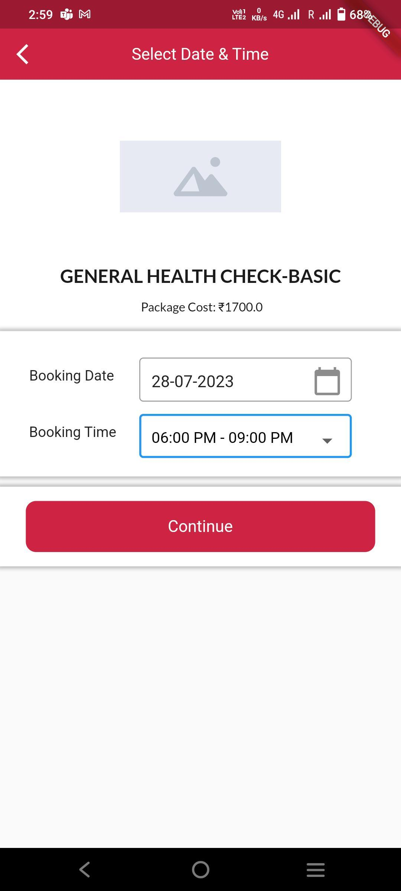
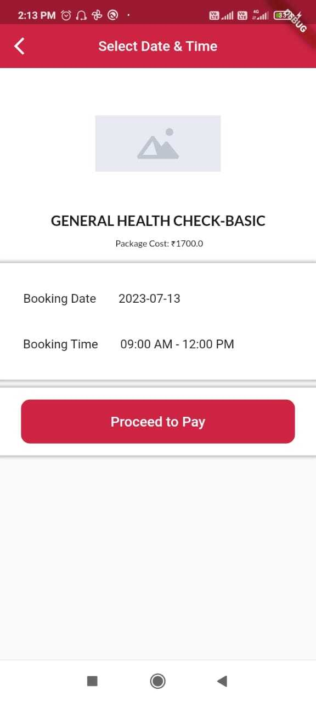
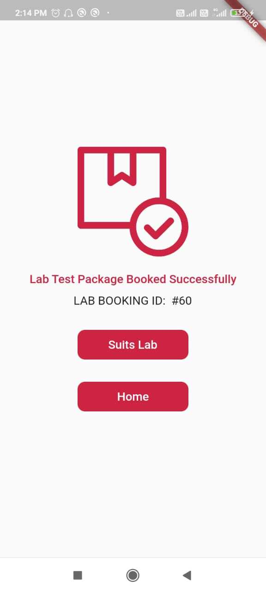
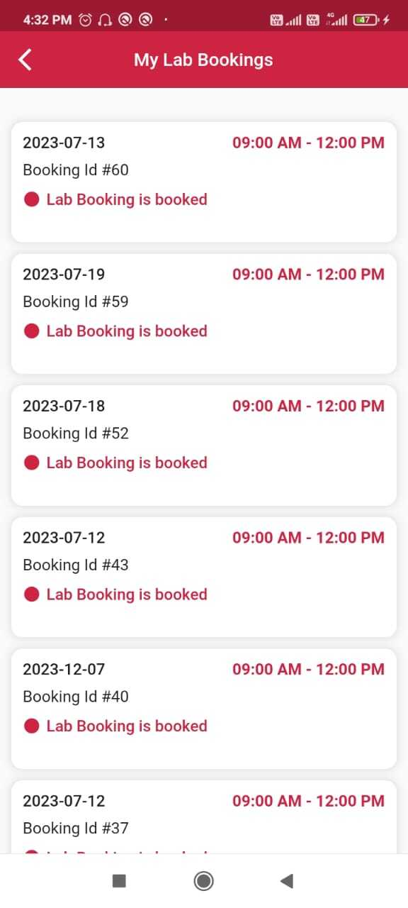

# Lab Module

The Suits App Providing the facilities for Lab Tests and Health packages

1. User can get into Lab Section through Network nagivation Bar present in suits app.

2. Once User Clicks on Labs , User will navigating into Lab Homescreen Which will Display all Lab providers and Lab test Categories.

3. User can Click on any providers to get into a another screen which will ask for choosing interest Categories ,same User can able to choose from the homescreen it self.

4. Once User Clicks on any category it will display the Popular Health packages that a User can Book.

5. User is interested in a particular Lab Health Package and Click on Book Now ,App will navigate into Adress Selection page where user can add or choose the interested Adress.

6. Once Click on Continue App Will redirect to the select Date and Time page ,where user can select interested date and time .

7. Next Screen allow the user to review the user given details before proceeding to pay.

8. Then user can pay the Asked amount to Confirm the Booking. Once Payment is success User will able to see the below Success Screen,which allow the user to redirect to Suits Homescreen as well as Home Screen of Suits App.

9. User can Able to see their bookings through the drawer section.Once the Click on My Lab Bookings, it will display all past bookings that user did as below.

