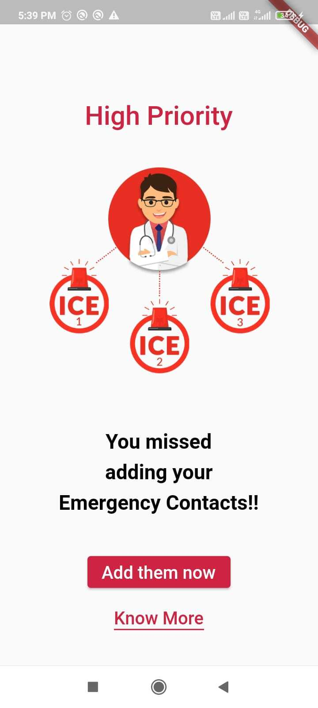
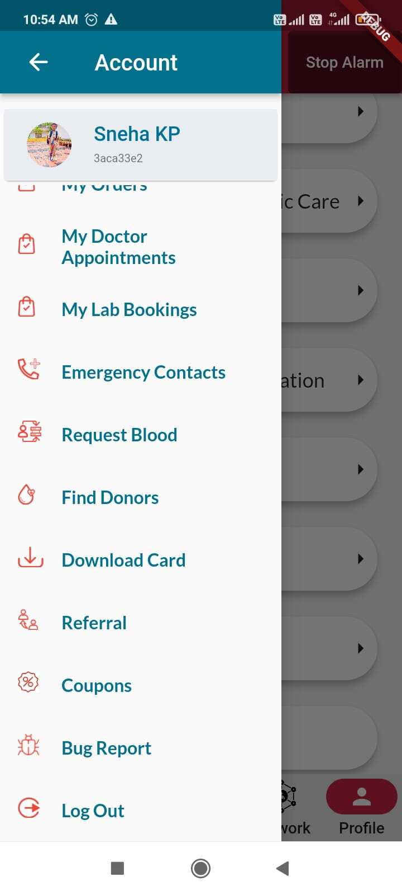

# Adding ICE contacts

## Step 1 : Access the Emergency Contacts page

1.  There are 3 ways to reach this page to add emergency contacts.

      a. When the User is logging In for First Time after signup, user will get a Page which will ask the user to add high priority emergency contacts.From this page the user can nagivate into two pages.

            
      (1). Once the user clicks the Add them now button ,user will be navigated to Emergency Contacts page where user can enter the Three ICE Contacts.

      (2). Once the user clicks on Know More button, User Will able to see the page which will provide a clear understanding about the ICE Card as well as the Emergency contacts.

      b. To access the page, choose the Emergency Contacts option from the Navigation drawer.

      c. To access the page, choose the Add Emergency Contact option from Profile screen.

## Step 2 : Provide your information

1. On the Emergency Contacts page, user will see a form to add 3 close emergency contacts.

      a. Minimum one contact user must enter and maximum three.

      b. Same number can't be repeated.

      c. current user's number can't be added.

2. User can update the emergency contacts by selecting the UPDATE button at the bottom of the page, just above know more text.

## Step 3 : Know more

1. If user is not clear about the ICE feature, then user can click on know more text and reach the ICE know more page.

2. click the back button at the top to go back to Emergency Contacts page.

## Step 4 : Update Emergency Contacts

1. If there is no validation error after selecting the UPDATE buttton, user will be given some option

2. User can select the Go To Home button to reach the ICE main page.

3. User can opt for physical Emergency cards to get it delivered.

4. User can download the ICE card from Download cards page by selecting the Download Emergency Card on phone(free) option.

