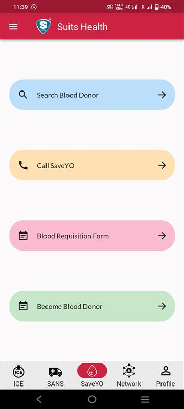
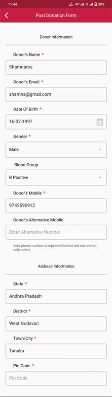
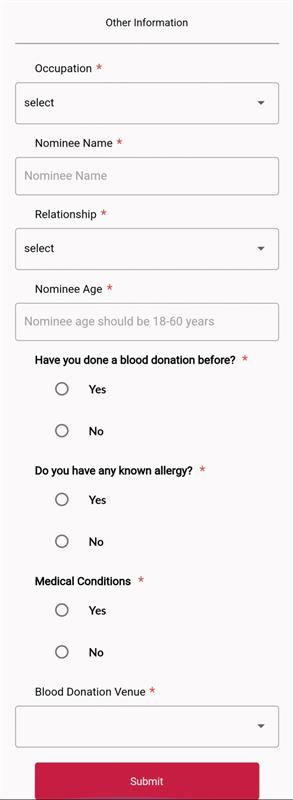
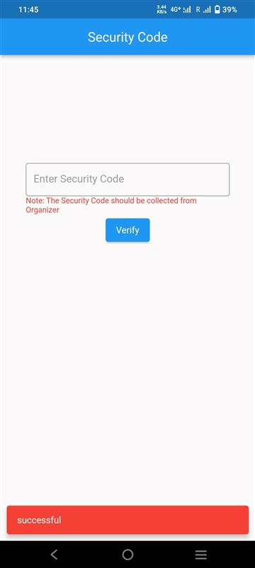
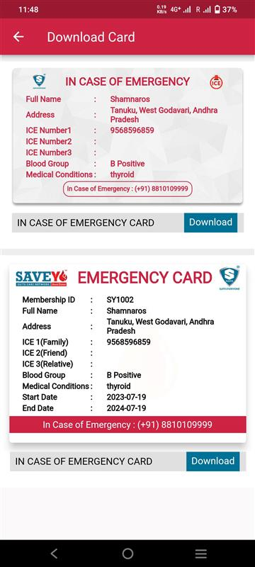
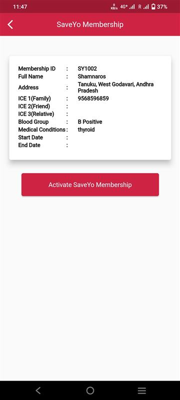

# Becoming A Blood Donor

## Step 1 : Access the SaveYO page

1.  Select Become Blood Donor from SaveYO in bottom navigation, From here user will be able to become a blood donor.

            

## Step 2 : Post Donation Form

1. If user hasn't submitted the post donation form before, then on selecting the become blood donor, user will be redirected to Post Donation Form.

2. User has to fill the Post Donation Form.

      a. Minimum age is 18 years.

      b. Nominee age should be 18-60 years.

3. User can fill all the mandatory fields and submit the form.

4. User will be redirected to enter the security code. And after verifying the security code, user will be redirected to download cards.

5. User can download the SaveYO card from download cards page.

## Step 3 : Activate SaveYo Membership

1. If user has submitted the post donation form and didn't verify the security code then, when user clicks on Become Blood Donor in SaveYO page, user will be redirected to SaveYo Membership page where user can activate the membership by clicking on the Activate SaveYo Membership button.

2. User will be redirected to enter the security code. And after verifying the security code, user will be redirected to download cards.

3. User can download the SaveYO card from download cards page.

## Step 4 : SaveYo Member

1. If user is already an Active SaveYo Member then, If user clicks on Become Blood Donor in SaveYO page, user will be redirected to SaveYo Membership page where user can redirect to download cards by clicking on Download Card button.

2. User can download the SaveYO card from download cards page.

