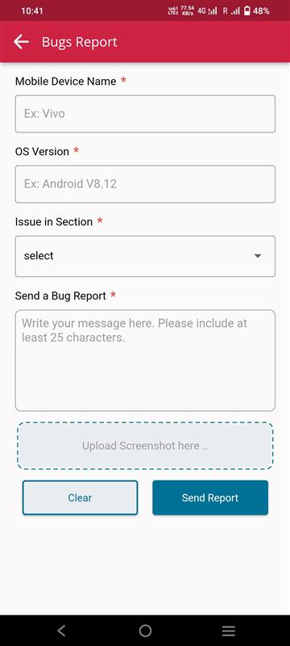

# Bug Reporting

## Step 1 : Access the Bugs Report page

1. Select Bug Report from Navigation drawer

## Step 2 : Report Bug

1. Fill all the mandatory fields in the form and attach a screen shot for reference.

2. Discription should be more than 25 characters.

3. Screen shot image size should be lessthan 2MB.

4. Select clear to clear everything so far written and attached.

5. Select Send Report to send the report and user will be navigated to ICE page.

