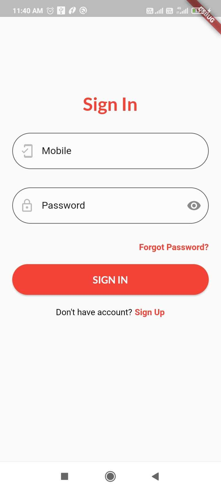

# Forgot Password & Change Password

## Step 1: Forgot Password

1. while SignIn, If you forgets the password, then select Forgot Password from SignIn page.

2. you will be redirected to Forgot Password page. Enter registered mobile number and Select send otp. you'll be redirected to verify otp page.

3. Wait for the application to process your information, once its done you will be getting an OTP for Verification ,Enter the OTP and press on the Submit Button to redirect to Change password page.

4. Enter the new password and confirm password click on Submit to change the password and redirect to SignIn page

## Step 2: Change Password

1. If user wants to change password, then select Change Password from Profile.

2. you will be redirected to Change Password page. 

        a. Enter old password, new password and confirm the new password.

        b. Old password and new password shouldn't be same.

        c. click on submit to change the password and redirect to profile.

