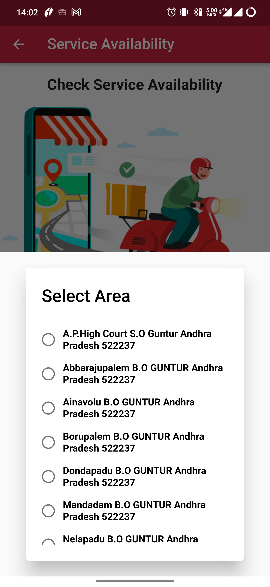

# Emergency Consultation Booking

Our platform now offers the convenience of booking emergency consultation appointments for all users in need of urgent medical attention. Whether you require immediate assistance or have a pressing medical concern, our service allows you to schedule an appointment promptly. To access the booking system, navigate to the Network menu page on our platform and click on the 'Doctors' section. From there, you will be guided through the appointment booking process, enabling you to connect with a suitable healthcare professional efficiently.

Our platform offers a convenient feature that allows users to find and access services provided by doctors in their local area. To do this, users simply need to enter their pincode, and the system will display a list of available doctors offering their services in that specific area.

After entering their pincode, users will have the option to select their desired area from the provided suggestions. Once the area is selected, the platform will present a comprehensive list of healthcare professionals available in that specific region. This user-friendly feature empowers individuals to easily navigate and explore various healthcare options within their chosen area, making it effortless to find and connect with suitable doctors for their medical needs.

After selecting any of the areas from the suggestions, the user will be directed to the specialties page, where they can explore and view the various specialties offered by different doctors. This page will present a comprehensive list of medical specializations practiced by the healthcare professionals available in the chosen area. Users can easily browse through the specialties, gaining insights into each doctor's expertise and making informed decisions about which medical professional aligns best with their specific healthcare requirements. This streamlined process ensures that users can conveniently access detailed information about different specialties and find the most suitable doctor for their medical needs.

In addition to exploring various specialties, the user will also have the option to select "Emergency Consultation." By choosing this option, they will be directed to a dedicated page that displays the availability of doctors offering emergency consultation services in the selected area.

On this page, users can quickly check the real-time availability of doctors and view their respective payment charges for emergency consultations. The platform will present transparent and up-to-date information about the cost of each consultation, allowing users to make well-informed decisions before proceeding with their appointment booking.

This integrated approach ensures that users can easily assess both the availability and associated charges for emergency consultations in a single, user-friendly interface, making the process of seeking immediate medical assistance seamless and efficient.

In the next payment page, the platform will present various payment options to choose from, such as credit/debit cards, online banking, mobile wallets, or any other available payment methods. Users can comfortably choose the most convenient payment mode for them.

By offering this flexibility, the platform ensures that users can seamlessly proceed with booking emergency consultations with their chosen healthcare professional without any payment-related hurdles. This streamlined process aims to provide swift access to medical assistance during critical situations, enhancing the overall user experience and ensuring prompt healthcare support.

After a successful login, the user will receive a confirmation message indicating that the login was successful. In case of any login issues or failures, the user will receive an appropriate error message, prompting them to try again or seek further assistance.

Upon receiving the success or failure message, the user will be automatically redirected to the confirmation page. The confirmation page serves as a personalized dashboard or landing page for the user, providing relevant information and options based on their profile and previous interactions with the platform.

On the confirmation page, the user may find details related to their account, appointment history, upcoming appointments, recommended services based on their preferences, and other relevant information. It is designed to offer a seamless and user-friendly experience, allowing the user to navigate through the platform's features with ease and efficiency.

This confirmation page serves as a central hub for the user's interactions with the platform, providing a cohesive and well-organized interface that enhances their overall user experience.

On the confirmation page, the user will find a prominent button or link that allows them to access the "Bookings" page. By clicking on this button, the user will be taken to a dedicated section where they can manage their booked appointments.

On the "Bookings" page, the user can view all their scheduled appointments, including past and upcoming ones. It will display essential details like appointment dates, times, the names of the booked doctors, and any other relevant information about each appointment.

This intuitive and easy-to-navigate "Bookings" page empowers the user to stay informed about their medical appointments, providing them with a convenient way to review, modify, or cancel their bookings as needed. It ensures that the user has quick access to their appointment information and enables them to maintain better control over their healthcare scheduling.

