# Book an appointment online & offline

Our platform offers a seamless solution for emergency consultation bookings, catering to all users in need of urgent medical assistance. Whether you require an online or offline appointment, our Network menu page provides a convenient and user-friendly interface to book services with a wide range of doctors.

To initiate the appointment process, users can simply navigate to the Network menu page. There, they will find a dedicated section to access our comprehensive list of medical professionals. By clicking on the 'Doctors' option, users can explore a diverse selection of healthcare specialists, covering various medical fields and expertise.

For critical situations that demand immediate attention, our emergency consultation service ensures quick access to healthcare professionals around the clock. The system allows users to swiftly book appointments with their preferred doctors, even during times of urgency. Rest assured, our platform maintains a high level of responsiveness, ensuring that you receive the necessary medical care promptly.

Additionally, our flexible booking system offers the choice between online and offline consultations. Users can opt for virtual appointments from the comfort of their homes or schedule face-to-face meetings at the doctor's office, depending on their preference and medical requirements.

By prioritizing ease of use, accessibility, and promptness, we aim to provide a seamless and reliable platform for emergency consultation bookings. Our commitment to ensuring your well-being drives us to continuously improve and enhance our services, ensuring a positive and reassuring experience for all our users

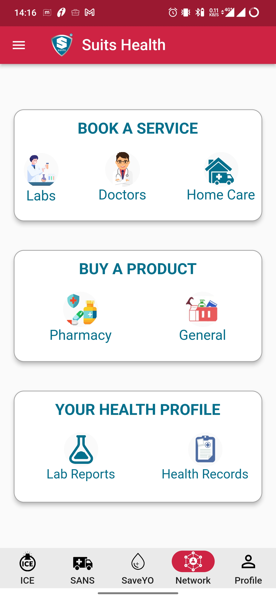

After clicking on the "Doctors" option, users can easily check the availability of medical services in their respective pincode areas. The platform displays a list of nearby doctors, along with their specializations and real-time availability status. Users can filter and sort the results based on their preferences. Once they find a suitable doctor, they can proceed to book an appointment conveniently through the platform.

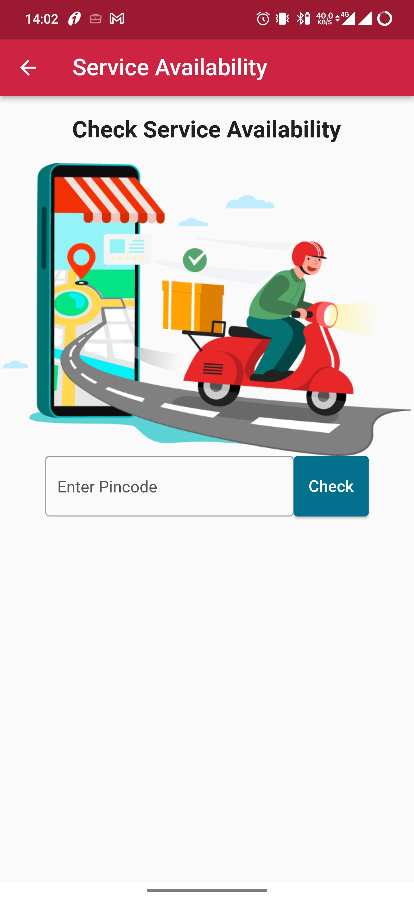

The platform then presents a comprehensive list of doctors practicing in the selected area, providing information about their specialties, credentials, and real-time availability status. Users can easily filter and sort the results based on their preferences, making it quicker to find the most suitable healthcare professional.

When users identify a doctor that meets their needs, they can effortlessly book an appointment online or offline, depending on their preference and the doctor's availability.

By allowing users to select their area, our platform ensures a more personalized and convenient experience, making it easier for them to connect with nearby doctors and access the medical care they require promptly.

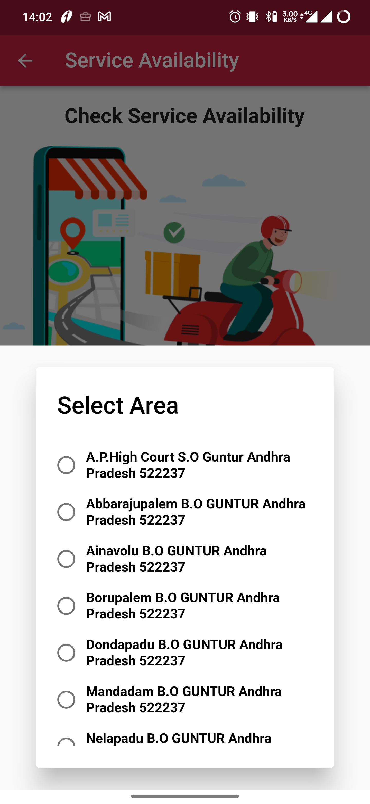

After users have selected their area or entered their pincode, they can be directed to a new page that showcases a list of the top doctor specialists in that particular location. This feature allows users to quickly identify and connect with the most reputable and highly recommended healthcare professionals in their area. Here's how the new page could be described:

Once users select their area or enter their pincode, they are redirected to an exclusive page featuring a curated list of the top doctor specialists in the chosen location. These specialists have been carefully selected based on their exceptional medical expertise, track record, and overall reputation within the community.

The top doctor specialist list provides users with a quick overview of each doctor's area of specialization, experience, qualifications, and accolades. It also includes important details such as clinic, contact information, and availability for consultations.

By presenting users with this handpicked selection of distinguished doctors, we aim to simplify their decision-making process and ensure they receive the highest standard of healthcare services. Whether they seek specialized treatment or general medical advice, these top doctor specialists offer an assurance of excellence and expertise.

Users can easily explore each specialist's profile to learn more about their professional background, empowering them to make informed choices when booking appointments.

Our platform's commitment to providing a top-notch user experience extends to this new page, where we prioritize quality, convenience, and patient satisfaction above all else. By connecting users with the best medical experts in their area, we strive to make healthcare access easier and more reliable for everyone.

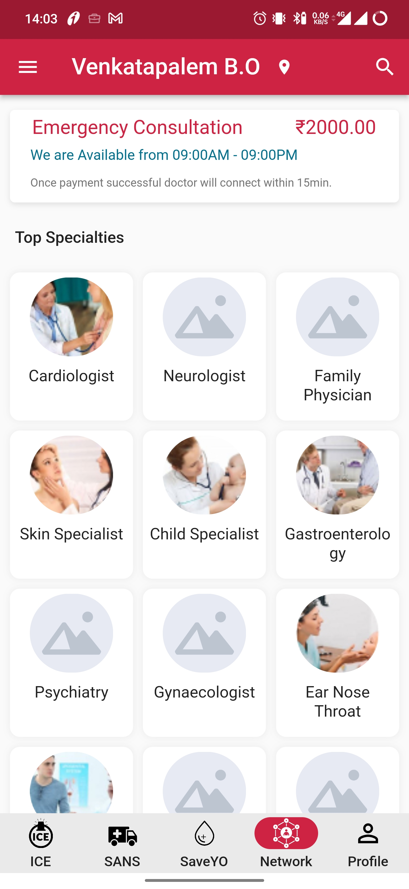

## Offline Consultaion Booking

After selecting a top specialty, the user can view a list of doctors in that field with their names, details, and fees. They can then choose their preferred doctor and click on the "Book Hospital Visit" button to initiate the appointment booking process.

After clicking on the "Book Hospital Visit" button for their preferred doctor, the user will be presented with a calendar or time slots for available appointments. They can select a suitable time slot that aligns with their schedule and confirm the appointment. This feature allows users to conveniently choose a time that best fits their availability for the hospital visit.

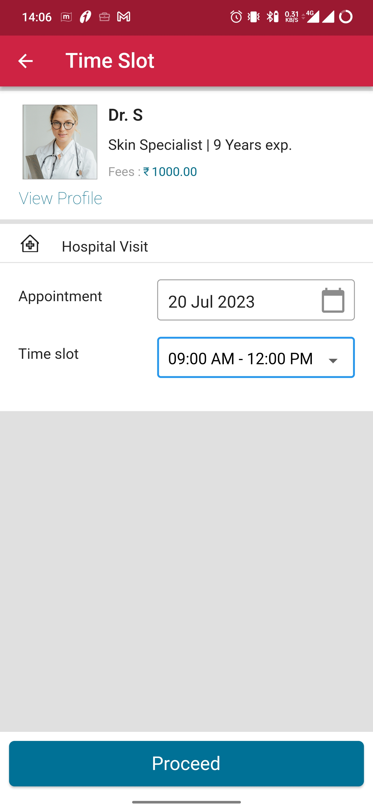

After selecting the desired time slot for the hospital visit, the user will be directed to the check-out page, where they can review and confirm their appointment details. The check-out page will display essential information about the appointment, including the chosen doctor, date, time slot, consultation fees, and any other relevant details.

At this stage, the user has the opportunity to verify that all the information is accurate before proceeding with the final confirmation. Once they have reviewed the details and ensured everything is in order, they can proceed to complete the booking by making the necessary payment, if required.

The check-out page serves as a final checkpoint to ensure that the user has made the correct selections and has a clear overview of the appointment details before finalizing the booking. It ensures a smooth and hassle-free booking process, allowing users to confidently proceed with their hospital visit.

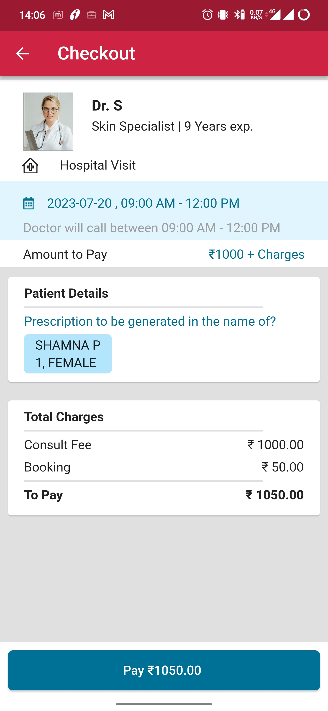

In the next payment page, the platform will present various payment options to choose from, such as credit/debit cards, online banking, mobile wallets, or any other available payment methods. Users can comfortably choose the most convenient payment mode for them.

By offering this flexibility, the platform ensures that users can seamlessly proceed with booking emergency consultations with their chosen healthcare professional without any payment-related hurdles. This streamlined process aims to provide swift access to medical assistance during critical situations, enhancing the overall user experience and ensuring prompt healthcare support.

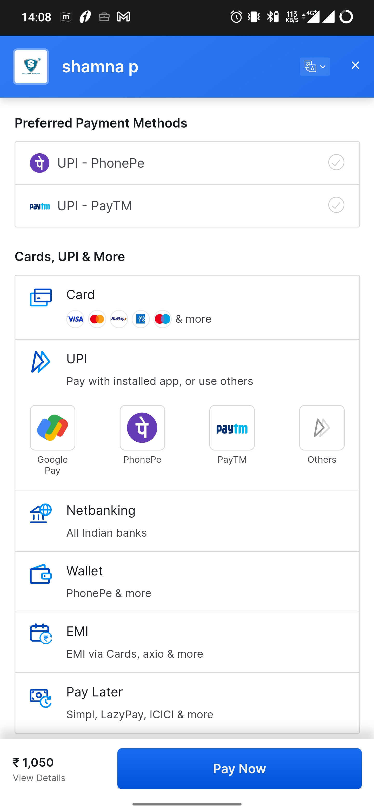

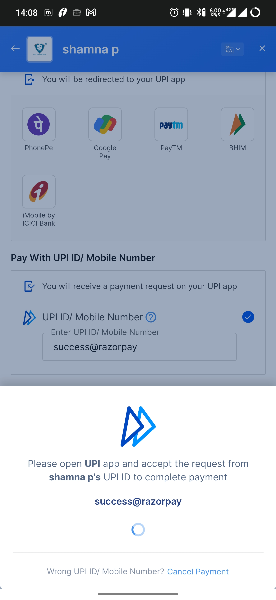

After a successful login, the user will receive a confirmation message indicating that the login was successful. In case of any login issues or failures, the user will receive an appropriate error message, prompting them to try again or seek further assistance.

Upon receiving the success or failure message, the user will be automatically redirected to the confirmation page. The confirmation page serves as a personalized dashboard or landing page for the user, providing relevant information and options based on their profile and previous interactions with the platform.

On the confirmation page, the user may find details related to their account, appointment history, upcoming appointments, recommended services based on their preferences, and other relevant information. It is designed to offer a seamless and user-friendly experience, allowing the user to navigate through the platform's features with ease and efficiency.

This confirmation page serves as a central hub for the user's interactions with the platform, providing a cohesive and well-organized interface that enhances their overall user experience.

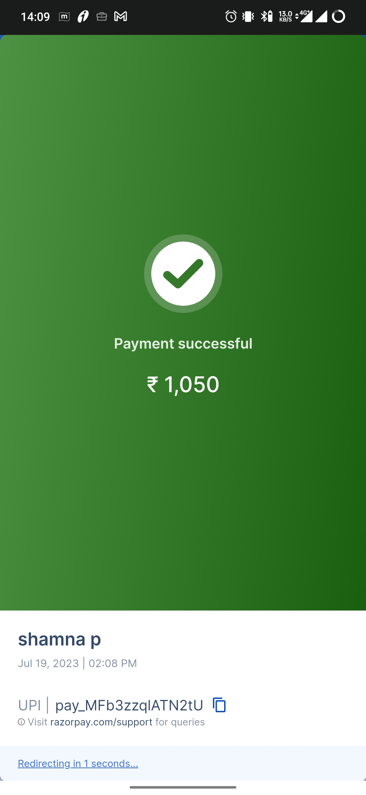

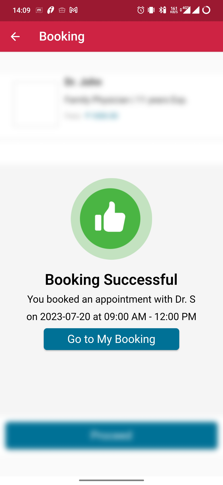

On the confirmation page, the user will find a prominent button or link that allows them to access the "Bookings" page. By clicking on this button, the user will be taken to a dedicated section where they can manage their booked appointments.

On the "Bookings" page, the user can view all their scheduled appointments, including past and upcoming ones. It will display essential details like appointment dates, times, the names of the booked doctors, and any other relevant information about each appointment.

This intuitive and easy-to-navigate "Bookings" page empowers the user to stay informed about their medical appointments, providing them with a convenient way to review, modify, or cancel their bookings as needed. It ensures that the user has quick access to their appointment information and enables them to maintain better control over their healthcare scheduling.

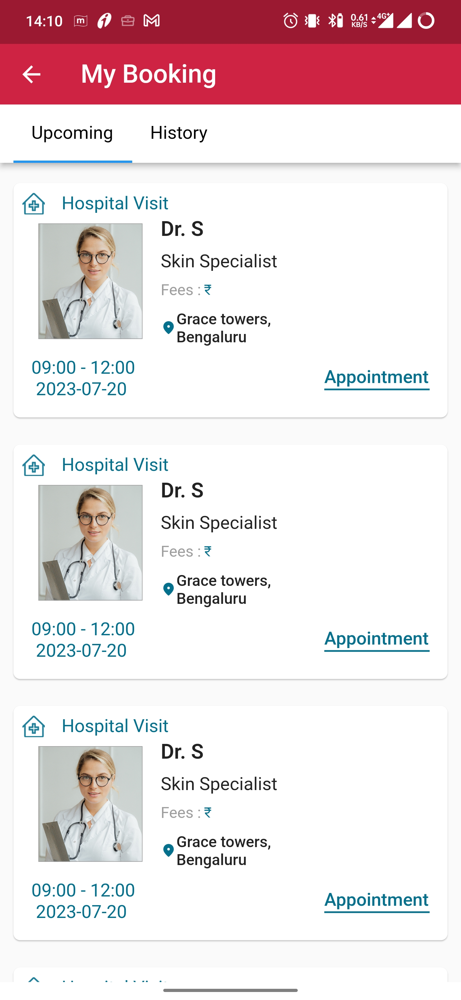

## Online Consultaion Booking

After selecting a top specialty, the user can view a list of doctors in that field with their names, details, and fees. They can then choose their preferred doctor who are available for online consultation at the preffered time and click on the "Book Video Consult" button to initiate the appointment booking process.

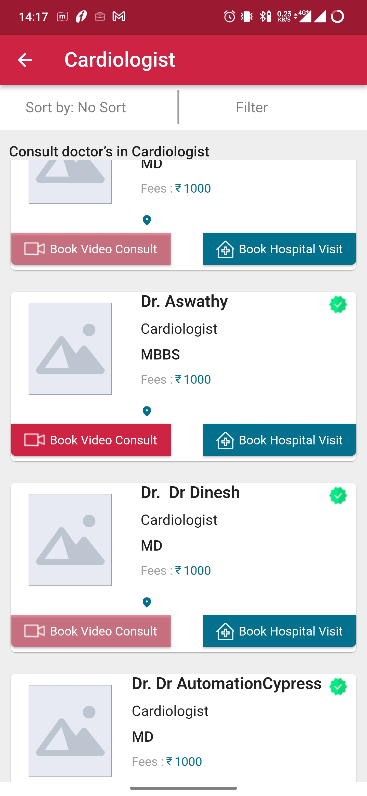

After clicking on the "Book Video Consult" button for their preferred doctor, the user will be presented with a calendar or time slots for available appointments. They can select a suitable time slot that aligns with their schedule and confirm the appointment. This feature allows users to conveniently choose a time that best fits their availability for the online consult.

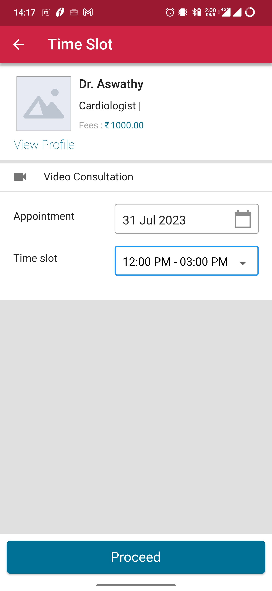

After selecting the desired time slot for the online consult, the user will be directed to the check-out page, where they can review and confirm their appointment details. The check-out page will display essential information about the appointment, including the chosen doctor, date, time slot, consultation fees, and any other relevant details.

At this stage, the user has the opportunity to verify that all the information is accurate before proceeding with the final confirmation. Once they have reviewed the details and ensured everything is in order, they can proceed to complete the booking by making the necessary payment, if required.

The check-out page serves as a final checkpoint to ensure that the user has made the correct selections and has a clear overview of the appointment details before finalizing the booking. It ensures a smooth and hassle-free booking process, allowing users to confidently proceed with their hospital visit.

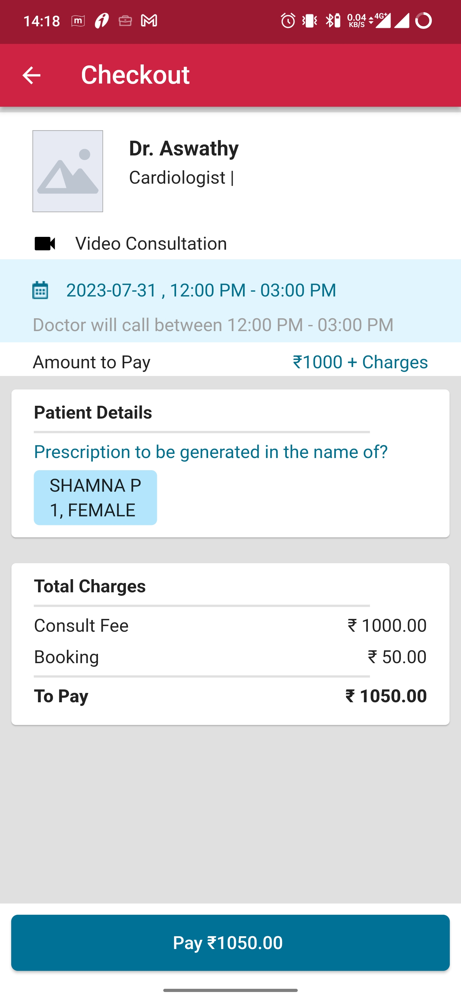

In the next payment page, the platform will present various payment options to choose from, such as credit/debit cards, online banking, mobile wallets, or any other available payment methods. Users can comfortably choose the most convenient payment mode for them.

By offering this flexibility, the platform ensures that users can seamlessly proceed with booking emergency consultations with their chosen healthcare professional without any payment-related hurdles. This streamlined process aims to provide swift access to medical assistance during critical situations, enhancing the overall user experience and ensuring prompt healthcare support.

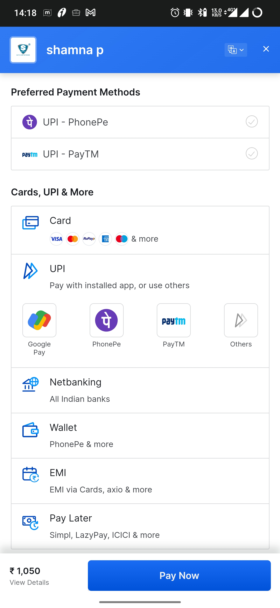

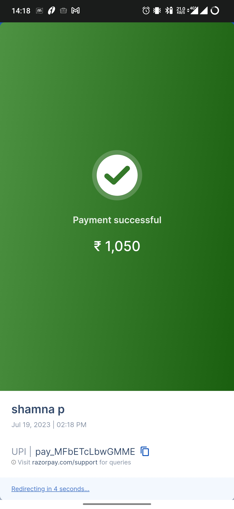

On the confirmation page, the user will find a prominent button or link that allows them to access the "Bookings" page. By clicking on this button, the user will be taken to a dedicated section where they can manage their booked appointments.

On the "Bookings" page, the user can view all their scheduled appointments, including past and upcoming ones. It will display essential details like appointment dates, times, the names of the booked doctors, and any other relevant information about each appointment.

This intuitive and easy-to-navigate "Bookings" page empowers the user to stay informed about their medical appointments, providing them with a convenient way to review, modify, or cancel their bookings as needed. It ensures that the user has quick access to their appointment information and enables them to maintain better control over their healthcare scheduling.

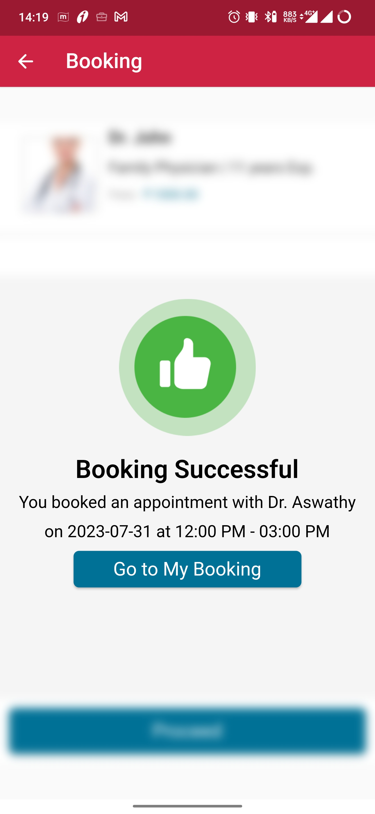
