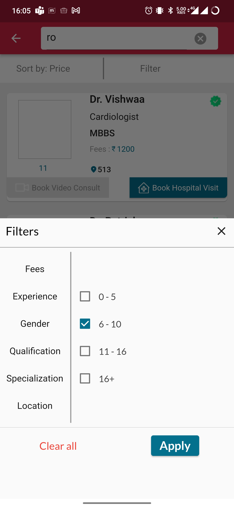

# Search/Sort Doctor

As a User, there will be a feature to search for doctors on the doctors' page. This functionality allows the user to quickly find specific doctors based on various search criteria. Here's how it works:

1. Search Bar: The doctors' page will have a search bar prominently displayed at the top. The admin can type in the name of a specific doctor, their specialization, or any other relevant keyword to initiate the search.

2. Filters: In addition to the search bar, the admin can utilize filters to narrow down the search results. Filters may include options like doctor's specialization, location, availability status, and more.

3. Search Results: After entering the search query or applying filters, the platform will display a list of doctors that match the criteria. The results will show the doctor's name, specialization, and other relevant details.

4. View Doctor Profiles: The admin can click on any doctor in the search results to access their detailed profile. This profile will contain comprehensive information about the doctor's background, experience, qualifications, contact details, and any patient reviews or ratings.

By providing the user with the ability to search for doctors efficiently, the platform ensures streamlined management and easy access to essential information. This feature enhances the user's ability to oversee up-to-date and well-organized list of healthcare professionals on the platform.

Sorting can be done based on experience and price to help you find the most suitable healthcare professionals for your needs. Here's how it works:

1. Experience: By selecting the "Experience" sorting option, the platform will arrange the doctors based on their years of experience. Doctors with more experience will be displayed at the top of the search results, giving you the opportunity to connect with seasoned healthcare professionals who have a wealth of knowledge in their field.

2. Price: Choosing the "Price" sorting option will organize the doctors based on their consultation fees. This allows you to compare the costs of different doctors and find options that fit within your budget.

With these sorting options, you can efficiently identify doctors with the desired level of experience and find the best pricing for your medical consultations. It streamlines the process of finding the right healthcare professionals, making it easier for you to book appointments and receive the medical care you need.

Filtering based on various criteria can significantly enhance your search for doctors. Here's how the platform can facilitate filtering options:

1. Fees: You can apply filters to view doctors based on their consultation fees. This allows you to find healthcare professionals that align with your budget.

2. Experience: Applying the "Experience" filter lets you see doctors based on their years of experience. This helps you find practitioners with the level of expertise you prefer.

3. Gender: By filtering based on gender, you can choose doctors that make you feel more comfortable and address specific health concerns.

4. Qualification: The "Qualification" filter enables you to narrow down doctors based on their educational background and certifications.

5. Specialization: This filter allows you to select doctors based on their area of expertise, ensuring you find the right specialist for your medical needs.

6. Location: Filtering by location helps you find doctors conveniently located near you, making it easier to access healthcare services.

By offering a range of filtering options, the platform empowers you to personalize your search for doctors, ensuring you find the most suitable healthcare professionals who meet your preferences and requirements.

