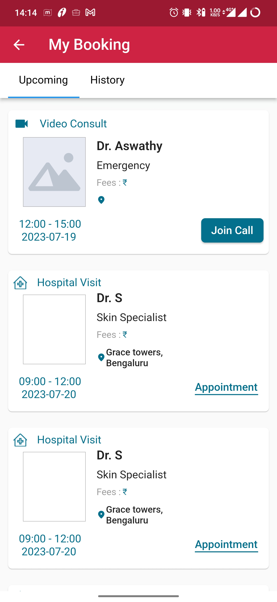

# View upcoming and history of doctor appointments

Users can easily view all their scheduled appointments by clicking on "My Doctor Appointments" in the sidebar menu. This section will display upcoming and past appointments, including essential details like the doctor's name, appointment date, and location.

Once users click on "My Doctor Appointments" in the sidebar menu, they will be directed to a page where they can view their upcoming appointments. On this page, they will find all the relevant details for each appointment, including:

1. Doctor's Name: The name of the doctor they have an upcoming appointment with.

2. Fees: The consultation fees for the appointment, providing transparency and clarity.

3. Date and Time: The scheduled date and time of the upcoming appointment.

4. Option to Join Online Call: If the appointment is an online consultation, there will be an option to join the call directly from the platform. This allows users to connect with the doctor virtually at the specified time.

By providing this simple and organized view of their upcoming appointments, users can easily keep track of their scheduled medical consultations and seamlessly access the necessary information, making their healthcare experience more efficient and user-friendly.

The platform will offer users another menu called "History," where they can access their complete historical records of past appointments. Here's how this feature will be presented:

1. History Menu: In the sidebar, users will find a menu option labeled "History." Clicking on this option will direct them to a page displaying all their past appointments.

2. Historical Records: On the "History" page, users will see a list of their previous appointments, sorted by the most recent ones first. Each entry will contain essential details, including:

   - Doctor's Name: The name of the doctor they had the appointment with.
   - Fees: The consultation fees paid for the specific appointment.
   - Address: The location (clinic or hospital) where the appointment took place.
   - Date and Time: The date and time of the past appointment.

3. Download Prescription: For each historical record, there will be a "Download Prescription" button. Clicking on this button allows users to access and download the prescription provided by the doctor during that specific appointment. This feature ensures users have easy access to their medical history and the prescribed treatments.

The "History" menu offers users a convenient and organized way to access their past medical records, including fees, addresses, dates, and times of previous appointments. Additionally, the ability to download prescriptions further enhances the platform's user-friendliness, empowering users to manage their healthcare information effectively.

