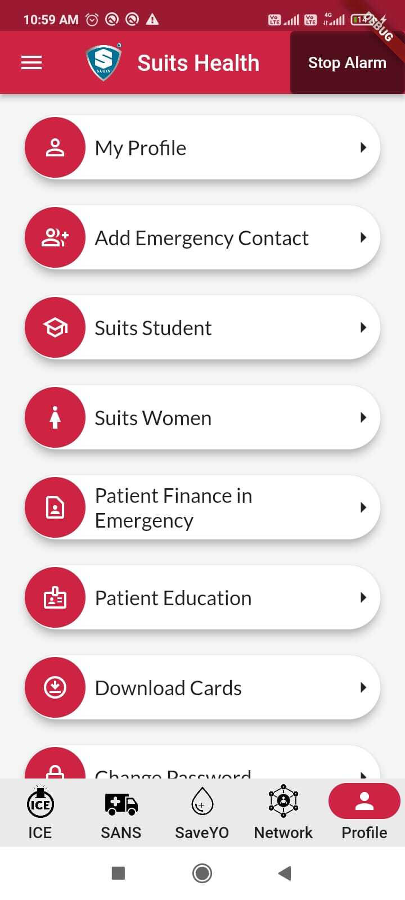
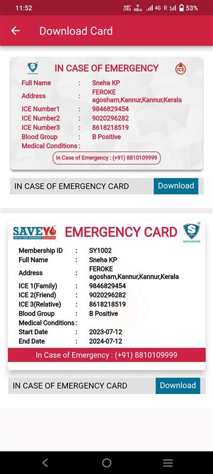
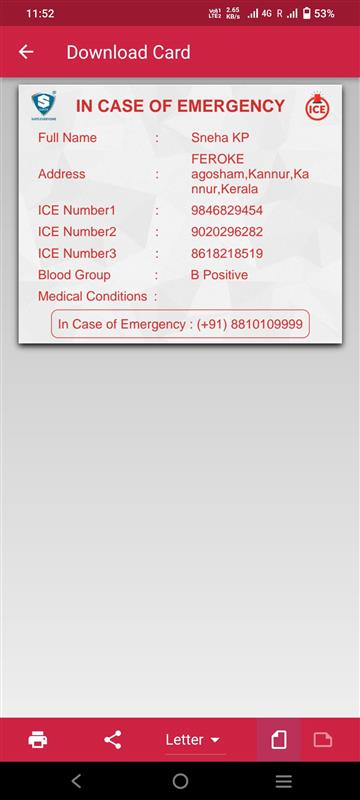
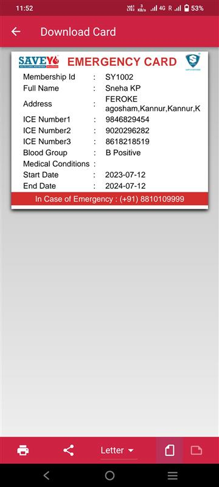

# Download ICE/SaveYO Card

## Step 1 : Access the Download Card page

1.  There are 2 main ways to reach this page to download ICE/SaveYO card.

      a. To access the page, choose the Download Card option from the Navigation drawer.

            
      b. To access the page, choose the Download Cards option from Profile screen.

## Step 2 : Download cards

1. In Download card page user will be able to view and download both ICE and SaveYo card.

## Step 3: Download ICE Card

1. Select IN CASE OF EMERGENCY CARD Download button at the bottom of ICE card to download the ICE card.

## Step 3: Download SaveYo Card

1. Select IN CASE OF EMERGENCY CARD Download button at the bottom of SaveYo card to download the SaveYo card.

