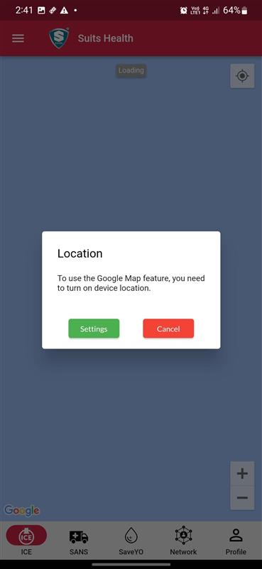
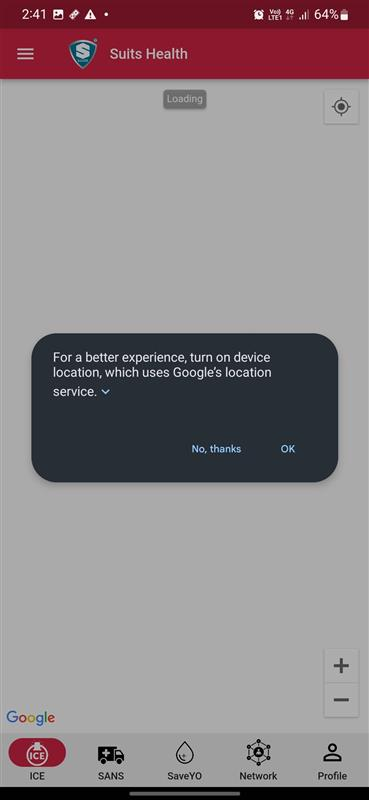
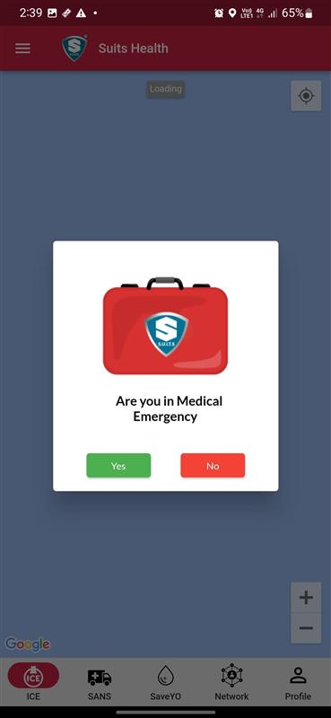
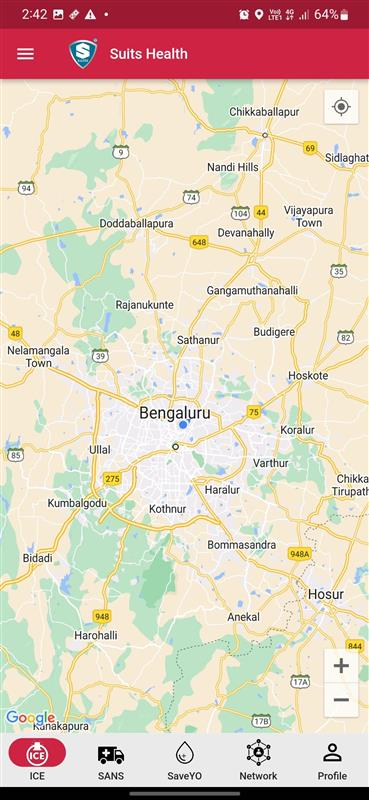
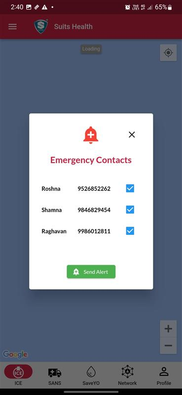
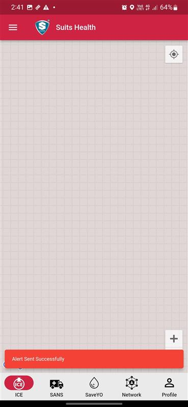
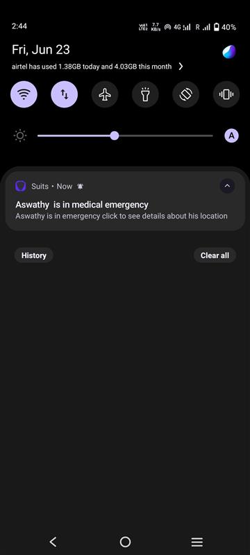
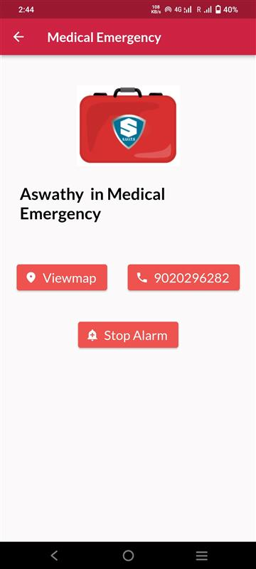
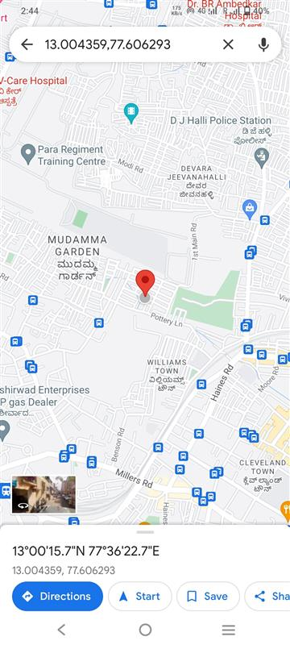

# Trigerring ICE Alert

## Step 1 : Location on

1. In Ice page, if users's mobile location service is off, then an alert box to turn on the location will be shown.

            
2. Select settings to go to mobile location settings and turn on the location service, or click on cancel, If you don't want to access any of the ICE features.

3. in the location turn on pop up, user can select OK, to turn on the location.

## Step 2 : Sending Alert

1. If user's location is on and user is in ICE page, then a alert box will appear asking are you in medical emergency. User can select the option accordingly.

      a. If user selects No, user can view the map with current location, ambulace, hosipal, blood bank and scare details.

2. If user selects Yes, user can view the list of emergency contacts added by user. From there user can choose to whom the alert should be send.

3. After choosing, user can select the Send Alert button to send the alert to their selected emergency contact's active suits user. (Suits App should be installed and loggedIn to receive the alert) 

4. After successfully sending the alert, a success message can be viewed in ICE page.

## Step 3 : Receiving Alert

1. In moblie user will receive an alert notification in the notification bar along with an alarm, to notify the user regarding the medical emergency.

2. From the notification bar, user can view who is in medical emergency or who send the alert.

3. Select the notification message to view Medical Emergency page with sender's information.

4. Select Stop Alarm button to stop the alarm.

5. Select the number to dial the number and call the sender.

6. Select Viewmap to view sender's location.

