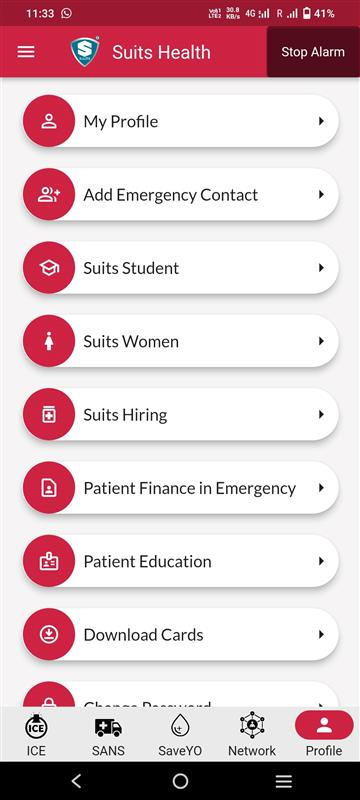
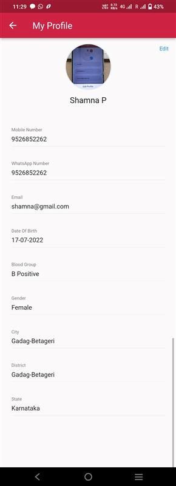
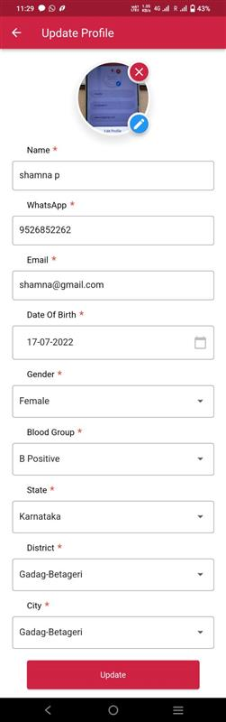

# Refer a contact

## Step 1 : Access the My Profile page

1. Select My Profile from Profile in bottom navigation

2. user can view profile details in My Profile.

## Step 2 : Update Profile

1. Select edit at top right corner to reach Update profile page

2. Update the required fields that you want to update.

3. profile image can be updated by clicking on the pencil icon on profile image.

4. To delete the profile image, select the cross icon and click on yes in the alert box.

5. Select Update button in the buttom to update the changes and redirect to My profile Page.

