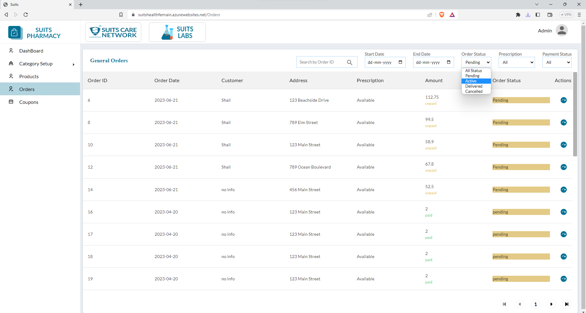
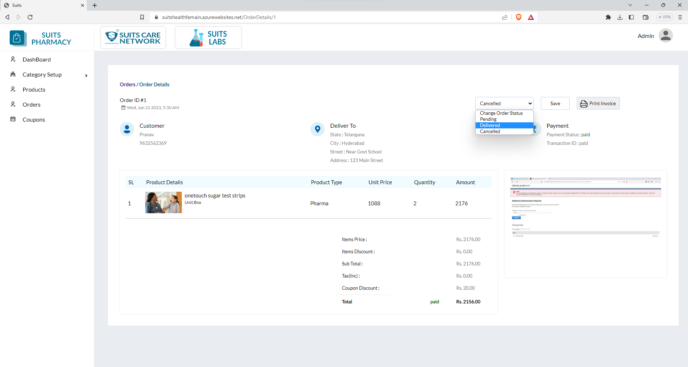

# Order Management

## All Order List

The General Orders list is presented in a table format and includes various columns such as Order ID, Order Date, Customer, Address, Prescription, Amount, and Order Status.

The administrator has several options to search and filter the orders based on different criteria:

1. Search by Order ID: The admin can enter an Order ID to quickly locate a specific order in the list.

2. Filter by Start Date and End Date: The admin can select a start date and an end date to filter the orders within a specific time range. This helps in viewing orders placed within a particular period.

3. Filter by Order Status: The admin can choose from various order status options like "Pending," "Active," "Delivered," and "Canceled." By selecting one or multiple status options, the admin can filter the orders based on their current status.

4. Filter by Prescription: The admin can filter orders based on Prescription availability. This can be done by selecting options like "Availability" or "Non-Availability" to view orders with or without a prescription.

5. Filter by Payment Status: The admin can filter orders based on the payment status. Options may include "Paid," "Unpaid," and "Failed." By selecting one or multiple payment status options, the admin can filter the orders accordingly.

By using these search and filter options, the admin can effectively navigate and manage the General Orders list based on specific criteria, allowing for streamlined order tracking and analysis.

## View Order Details

When the admin clicks on the View icon associated with a specific order, they will be able to access the detailed information of that particular order.

The order details page will present comprehensive information about the order, including the customer's name, contact number, and delivery address. It will also display the payment status along with the transaction ID, allowing the admin to track the payment and associated transaction details.

Additionally, the admin will have access to the product details related to the order. This will include a list of products included in the order, along with their respective quantities and individual prices. The order page will also display the total amount for the order, giving a clear overview of the financial aspect.

Based on the displayed details, the admin has the ability to modify the order status. The available options typically include "Pending," "Delivered," and "Cancelled." By changing the order status, the admin can update the progress or outcome of the order accordingly.

Furthermore, the admin can view the prescription associated with the order. This feature provides visibility into any prescription provided by the customer, allowing the admin to refer to the medical instructions or requirements, if applicable.

Lastly, the admin has the option to print the invoice. By clicking on the print icon or using a dedicated print function, the admin can generate a printable version of the invoice, facilitating record-keeping, documentation, or physical copies if needed.

Overall, the order details page offers comprehensive information and various functionalities to assist the admin in managing, tracking, and processing orders effectively.

