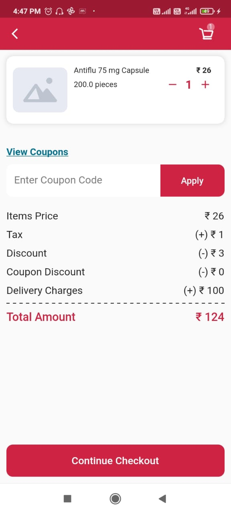

# Pharmacy/General Module

User can able to pay for Pharmacy products as well as General Health Products and Surgicals Through SUITS mobile Application.

1. User Will able to find Pharmacy and General in Network Section of Application.

2. Once the User Clicks on Pharmacy or General, User Will Navigate into Home Screen of Pharmacy or General.

3. User can Able to See Products of General/Pharmay Based on categories , Once click on any of the category, also they can see products listed in home screen as well.

4. User can add the Intrested products into their cart.

5. User Can able to see their Added Cart Products Once Clicked on the Cart icon Placed in the right most corner of the Pharmay/General Screens.

6. there User can Able to apply the Coupon Code Which User can Copy From Coupon Screen Once after Clicking on View Coupon.and once the user applied the coupon they will get discount of price.

7.User can Continue thier Checkout Process For buying their Interested products.They can add or select their required Address

8. User can able added their prescription details

9. Once the User reviewd the order Summary , They can Continue the Order.

10. User can Make the payment to complete the order.

11. Once the payment is success User will redirect into success page where user will able to redirect to home screen of application

12. User can able to see their order history through the drawer of application.

