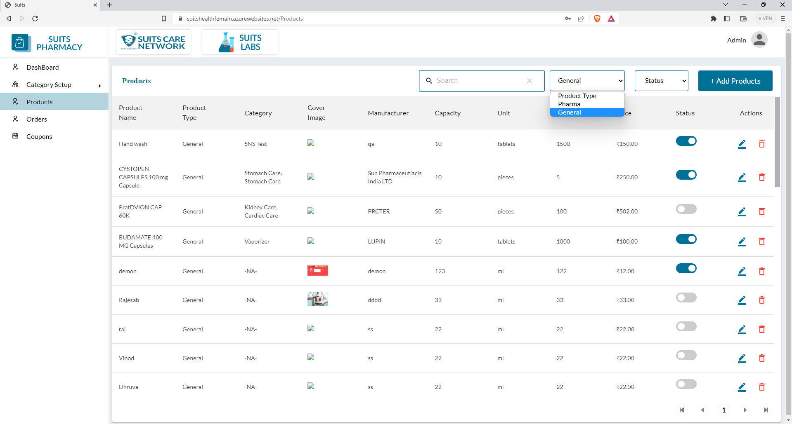
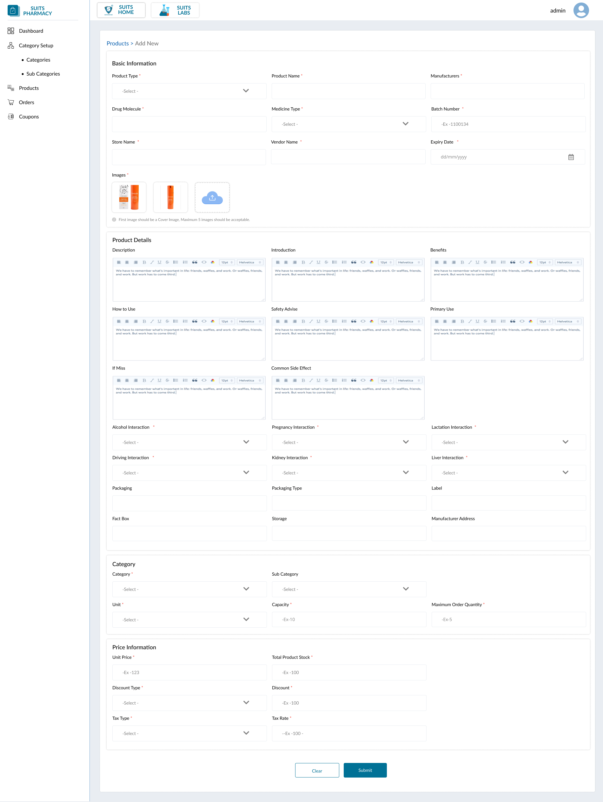
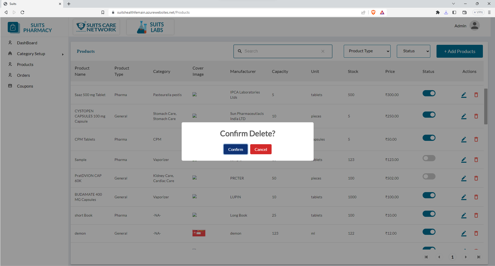

# Product Management

## All Product List

When you access the product listing page, you will find a comprehensive list of all the products available. To assist in finding specific products, there are various search and filtering options provided.

The search option allows you to enter relevant keywords or product names, helping you quickly locate specific products within the list. This functionality streamlines the process of finding desired items based on your search criteria.

Additionally, you can filter products based on their product type. The available options for product type are "Pharma" and "General." By selecting one of these options, the product list will be refined to display only products belonging to the chosen type. This filtering feature enables you to focus on specific categories of products based on their intended use or classification.

Furthermore, you can filter products based on their status, which can be classified as "Active" or "Inactive." By selecting the desired status option, the product list will be adjusted accordingly, displaying only the products that match the chosen status. This filter allows you to easily identify and manage active or inactive products within the system.

By utilizing the search option and applying filters based on product type and status, you can efficiently navigate and locate the desired products within the product listing page.

## Add New Product

## Delete Product

When you click on the delete icon associated with a product, you will have the ability to remove that product from the system.

By locating the specific product you wish to delete within the product list, you can click on the delete icon linked to that product. This action triggers the deletion process for that particular item.

Upon clicking the delete icon, the system will typically prompt you to confirm the deletion. This confirmation step is crucial to prevent accidental removal of products.

Once you confirm the deletion, the product will be permanently removed from the system. All associated data and records tied to that product, such as sales history, stock levels, and any linked information, will also be eliminated.

Deleting a product should be done with caution, as the process is irreversible, and the data cannot be easily recovered unless there is a backup or archival system in place.

By utilizing the delete icon, you can effectively manage your product inventory by removing obsolete, discontinued, or unwanted items from the system. This helps to keep your product database organized and up-to-date.

