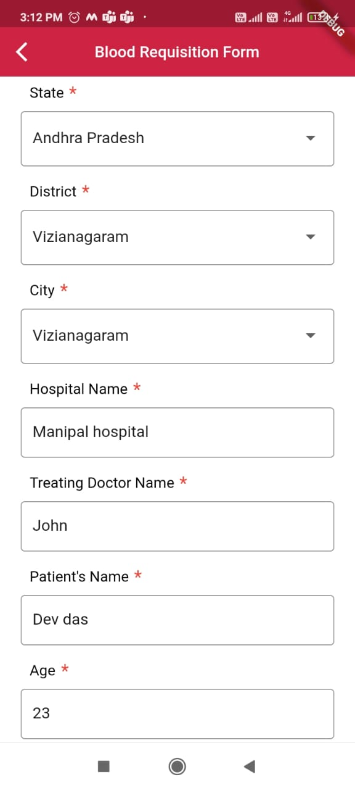
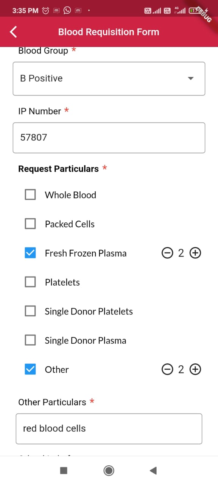
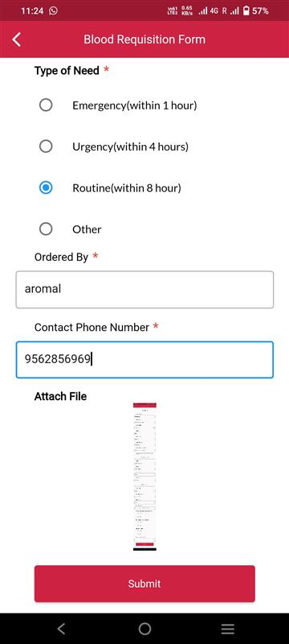
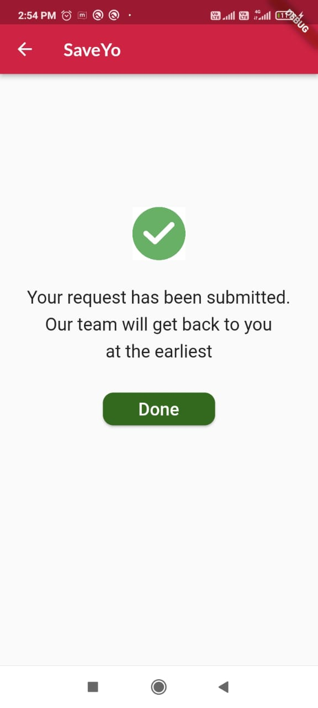

# Blood Requesting Form

User Will be able to request blood through the Suits Mobile Application

## Step 1 : Once the user logged into the application, they can nagivate into SaveYo Nagivation bar of the application

## Step 2: Click on Blood Requisition Form

Once You enter into the Blood Requisition From , You can able to Fill all the mandatory fields
The mandatory Fields include ,

1. State: Select respective state

2. District: Select respective district

3. City: Select respective city

4. Hospital name: Enter the Hospital name from where you are requesting blood

5. Treating Doctor Name: Enter the Treating Doctor Name.

6. Patient's Name: Enter the patient Name

7. Age: Enter Age of patient.

8. Gender: Gender of the patient

9. Blood Group: Select Patient Blood Group From the drop down.

10. IP Number:

11. Request Particulars: Here The User can Check all Needed Blood particulars with needed count, also User can able to request for other particulars which are not listed and also able to add count.

12. Type of Need: User can able to select type of need.

13. Order By: Enter the Communicating person Name for the particular blood request

14. Contact Phone Number: Enter the Contact Number Which will be the number the in which blood donating team will contact.

15. Attach File : User can able to attach medical record of patient. Which is optional field.

## Step 3: Submit Form

1.  Once you submit the form you will be getting a success Page as below.

