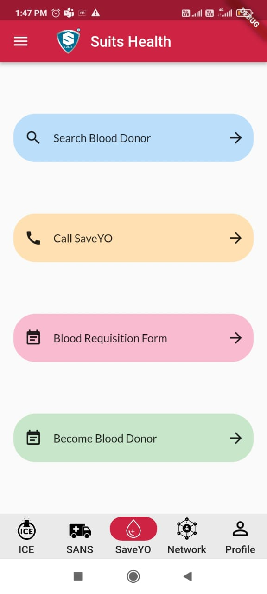
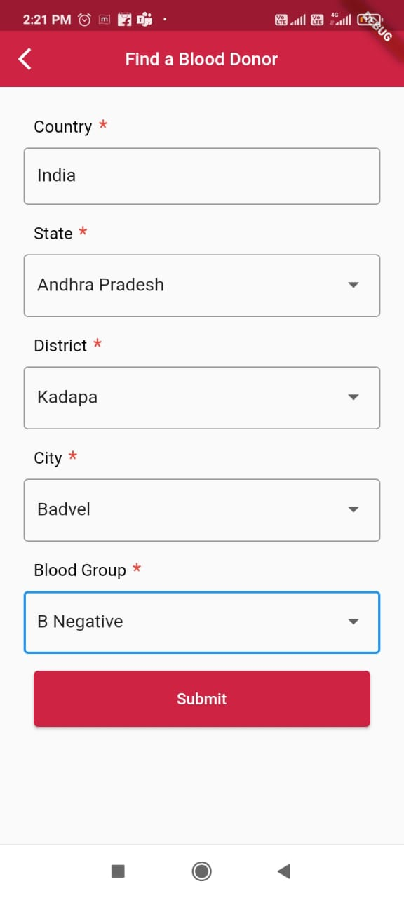
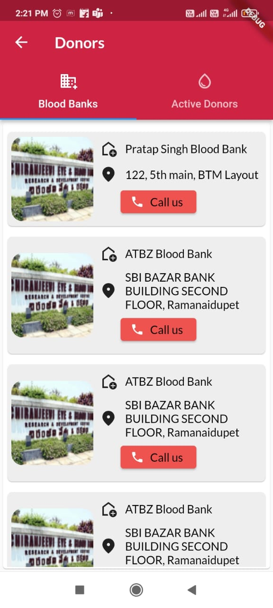
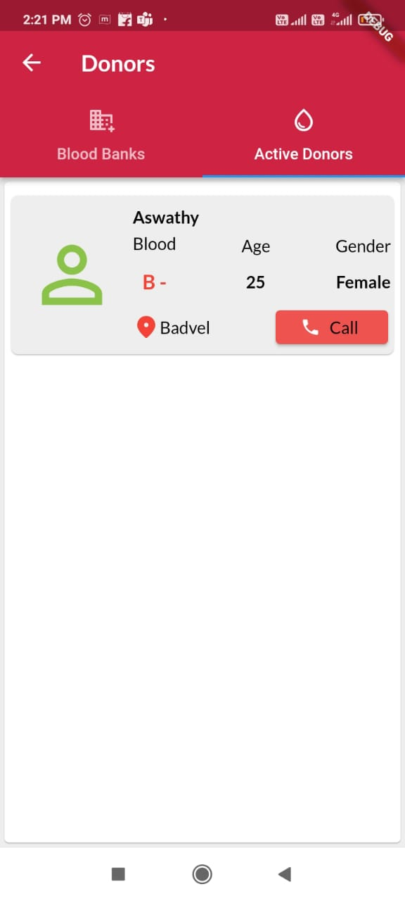

# Search Blood Donor

## Step 1 : Once the user logged into the application, they can nagivate into SaveYo Navigation bar of the application

## Step 2: Click on Search Blood Donor

1.  there you will be able to see a form which is expecting to fill your preferred state, District, City and Blood Group.
2.  Once you Fill the expected data, Click on submit.

## Step 3: You Will Be Navigating to a New Page Which contains Active Blood Donors as well as Active Blood Bank of respective state, district and city.

