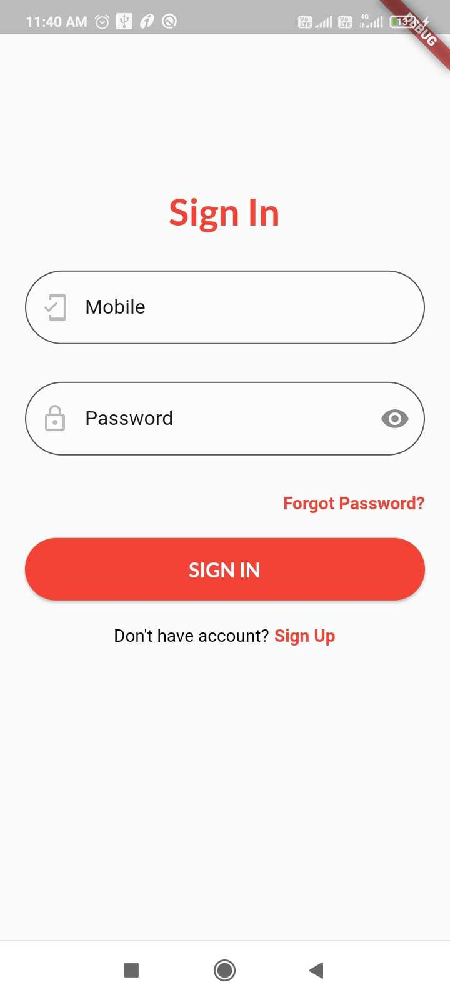
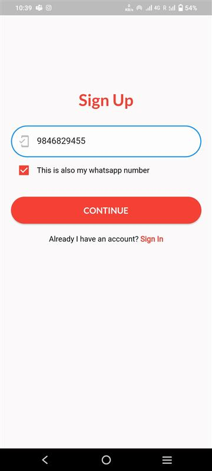
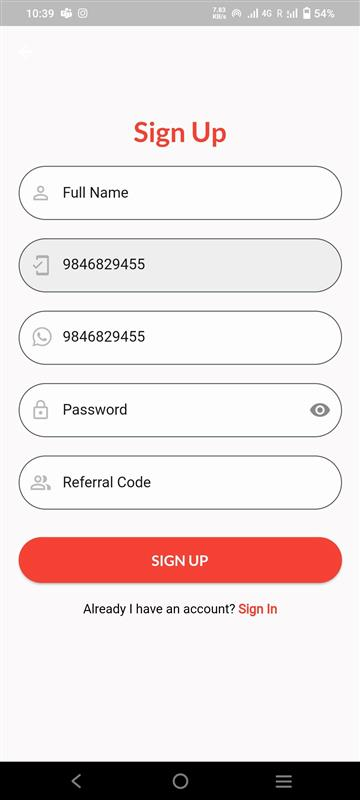
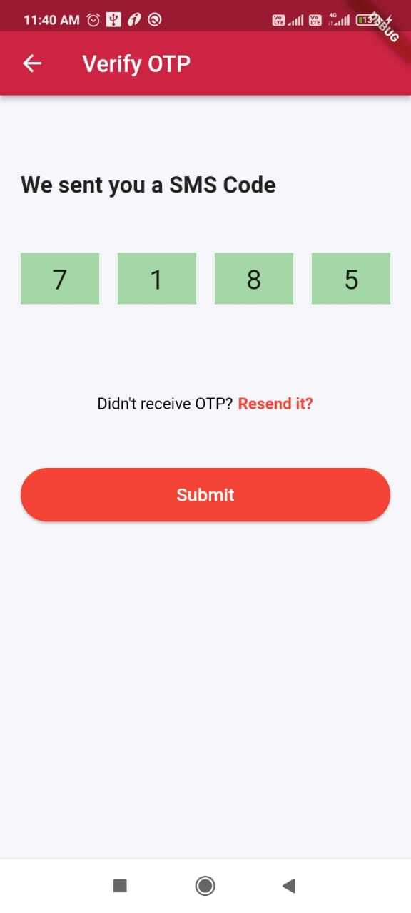
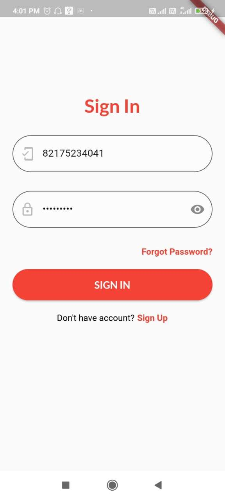
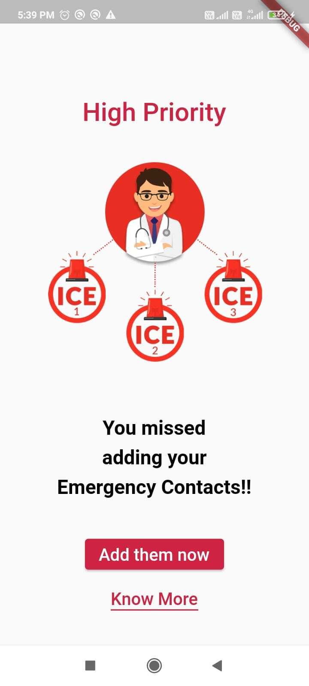
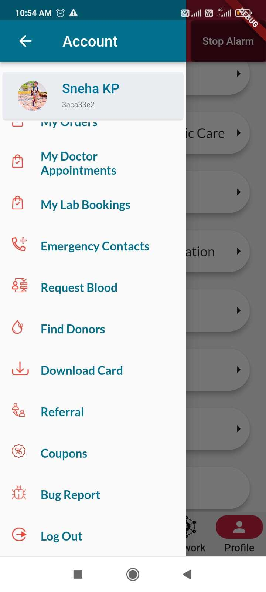
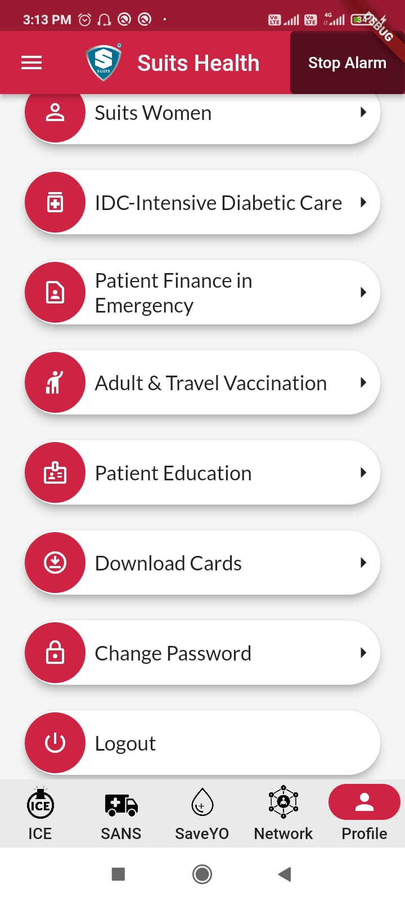

# USER SIGNUP/ SIGNIN/ LOGOUT

## Step 1:Access the Sign Up page

1.  Click on the 'Sign Up' button/link to proceed on the sign Up page.

2.  Click on the 'Sign Up' button/link to proceed on the sign Up mobile number verification page. If mobile number is already registered then you will get an error message, otherwise user will be redirected to SignUp page where user can fill the credentials.

## Step 2:Provide your information

1. On the Sign Up page, you will see a form with various fields to enter your information.

2. Fill the required fields which are indicate as mandatory.

3. Sign Up fields includes,

   a. Full Name: Enter your first Name and last Name.

   b. Password: Choose a secure password ,Ensure it meets the specified criteria (eg. minimum length,special characters)

   c. Referral Code: If you are referred by a User , you can enter referral code.Which is an optional filed.

## Step 3: Complete the Sign Up process

1. After providing your information and if everything appears correct Click on the 'SignUp' button.

2. Wait for the application to process your information, once its done you will be getting an OTP for Verification ,Enter the OTP and press on the Submit Button.

3. Once you have successfully Signed Up, you will be redirected to the login page.

## Step 4: Logging In

1. If user is not logged In then user will reach the SignIn page when App is opened. 

2. use your registered Mobile number and Password to log in to the application.

3. All new users are supposed to add emergency contacts before proceeding. Click on Add Them Now to add emergency contacts.

## Step 5:Logging Out

1. Logging out through the drawer menu:

   a. The drawer menu is typically a side navigation panel that allows users to access different sections or features of an application.

2. Logging out from the profile navigation menu:

