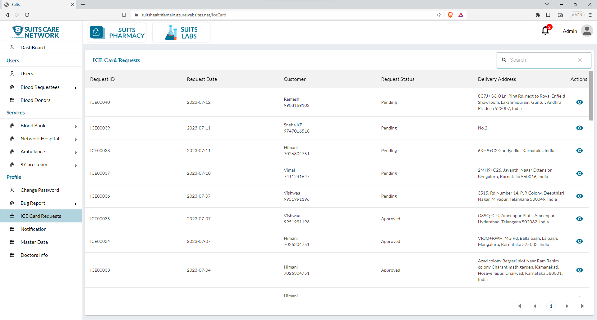
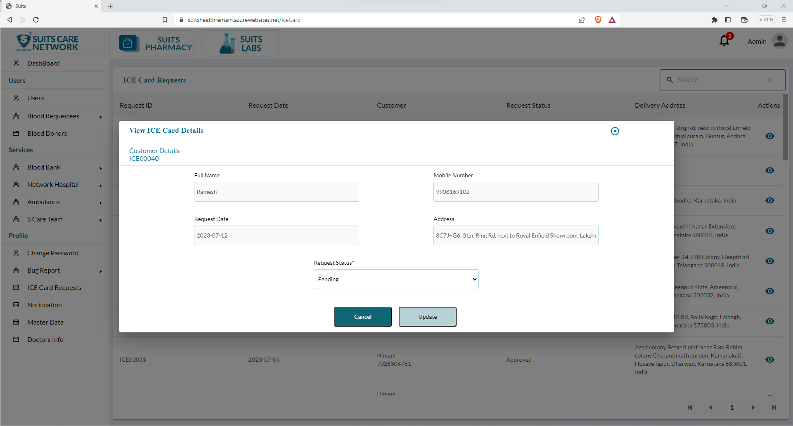

# ICE Card Request Management

## All ICE Card Request List

The admin has access to a page that displays the list of all ICE (In Case of Emergency) card requests within the system. This page provides an overview of the requests made by users for ICE cards.

On this page, the admin can view details of each ICE card request, including the requester's information (such as name and Requested Date), any specified emergency contacts, Delivery Address, and other relevant information provided during the request process.

## Update/Approve ICE Card Request

By clicking on the eye icon associated with a specific ICE card request, the admin can view the details of that particular request. This action will open a pop-up window or dedicated page, displaying comprehensive information about the ICE card request, including the requester's details, emergency contacts, medical information, and any other relevant information.

Within this pop-up window or page, the admin will typically find options to update or approve the ICE card request. By clicking on the corresponding buttons or links, the admin can make changes or modifications to the request, as well as approve the request if necessary.

