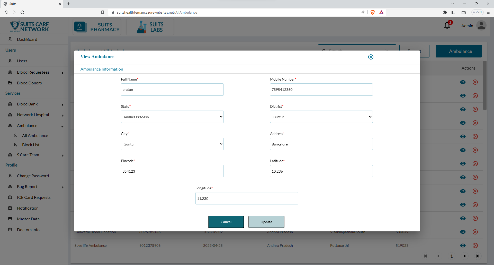

# Ambulance

## All Ambulance List

The admin has access to a page where they can view the list of all ambulances within the system. This page provides an overview of the ambulances registered in the system.

On this page, the admin has the ability to utilize a search functionality. This search feature allows the admin to enter specific search criteria, such as the ambulance name, location, or any other relevant details, and retrieve the corresponding results that match the search query. This makes it easier to find specific ambulances within the list.

Furthermore, the admin also has the option to export the ambulance list. By clicking on the export button, the admin can generate a downloadable file or report containing the information from the ambulance list. This exported file can be used for analysis, sharing with relevant stakeholders, or record-keeping purposes.

These features of search and export functionality provide the admin with efficient tools to manage and access information related to ambulances. The search option allows for quick retrieval of specific ambulance details, while the export feature facilitates the extraction and utilization of the ambulance list data in a convenient format.

## Add New Ambulance

The admin has the option to add a new ambulance to the system using either bulk upload or individual upload methods.

1. Bulk Upload: With the bulk upload feature, the admin can upload multiple ambulances simultaneously. They can prepare a file or spreadsheet containing the details of multiple ambulances, including their names, locations, contact information, and any other relevant data. By selecting this file, the admin can upload it to the system, which will automatically add all the ambulances listed in the file.

2. Individual Upload: Alternatively, the admin can add a new ambulance by manually entering its details one by one. They will be presented with a form or interface where they can input specific information, such as the ambulance name, location, contact details, and any other required fields. The admin can fill out the form for each ambulance individually and submit the information to add them to the system.

These options provide flexibility to the admin in adding new ambulances to the system. The bulk upload feature is useful for quickly adding multiple ambulances, while the individual upload option allows for more detailed and controlled entry of each ambulance's information.

## View/Update Ambulance

When the admin clicks on the eye icon associated with a specific ambulance, they can view the details of that ambulance. This action will open a pop-up window or dedicated page, displaying comprehensive information about the ambulance, such as its name, location, contact details, and other relevant information.

Within this pop-up window or page, the admin will typically find an option to update the ambulance's details. By clicking on this update option, the admin can make changes or modifications to the ambulance's information. They can edit fields such as the ambulance name, location, contact details, or any other relevant information that needs to be updated.

Once the admin has made the desired changes, they can save the updates, and the ambulance's information will be updated in the system accordingly.

This functionality allows the admin to conveniently view and modify the details of a specific ambulance, ensuring that accurate and up-to-date information is maintained within the system.

## Block Ambulance List

The admin has the option to block an ambulance, which temporarily restricts its access or functionality within the system. When an ambulance is blocked, it will be listed on a separate page specifically dedicated to blocked ambulances.

By blocking an ambulance, the admin can effectively limit its operations within the system for various reasons, such as non-compliance, policy violations, or other issues that require temporary suspension.

On the Blocked Ambulance page, the admin can view a comprehensive list of the blocked ambulances. This list typically includes details such as the ambulance name, location, contact information, and the reason for blocking.

Having a dedicated page for blocked ambulances allows the admin to easily manage and keep track of ambulances that have been temporarily suspended. The admin can review the blocked ambulances, take necessary actions, and monitor their status to ensure compliance with the system's policies and standards.

