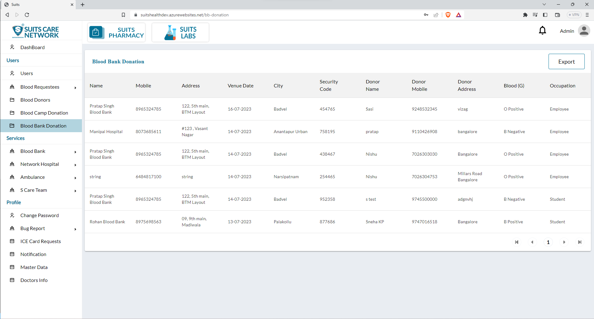

# Blood Bank Donation Management

## All Blood Bank Donation

The admin has access to a dedicated page where they can view the entire list of blood bank donation. This page provides an overview of all donations within the system.

Additionally, the admin will find a button to export the donor list. By clicking on this button, the admin can generate a downloadable file or report containing the information from the donation list. This exported file provides a comprehensive overview of the blood bank donation data and can be utilized for analysis, sharing with relevant stakeholders, or maintaining records.

These features provide the admin with efficient tools to manage and access blood bank donation information within the system. export option facilitates the extraction and utilization of the blood bank donation list data for various purposes.

