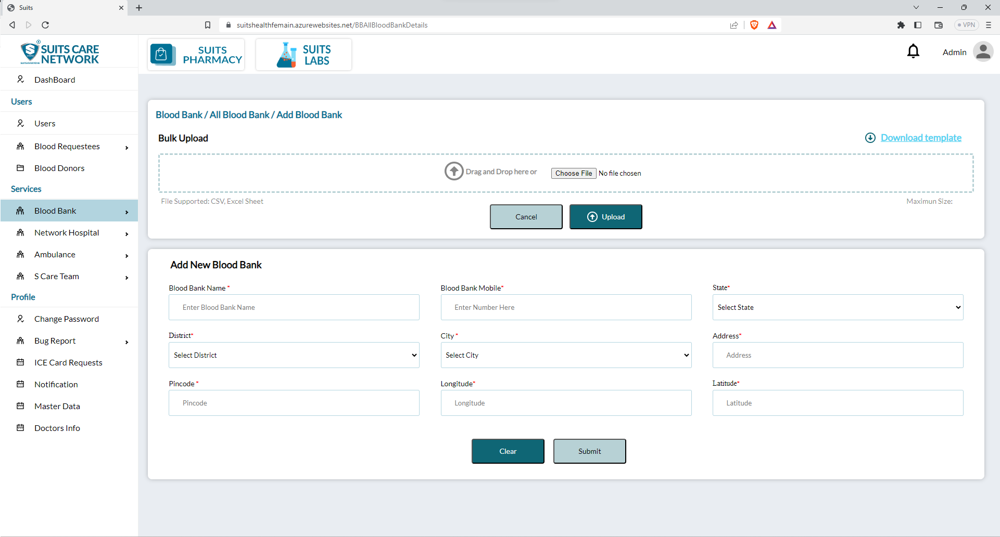
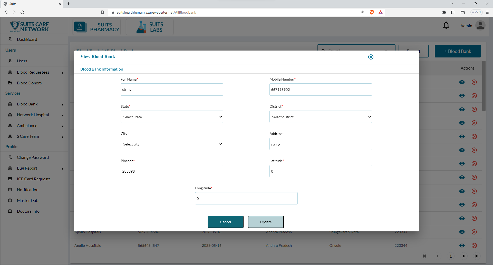
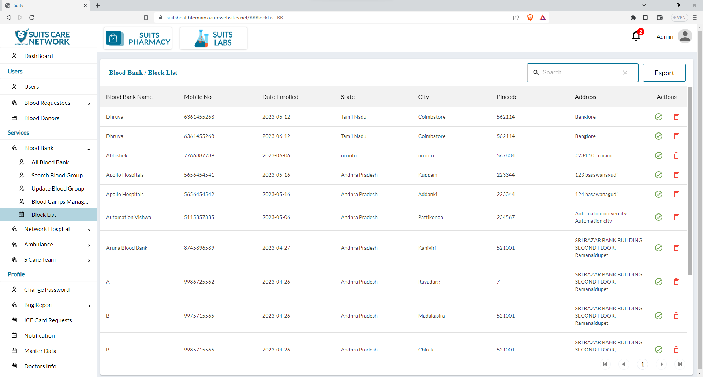
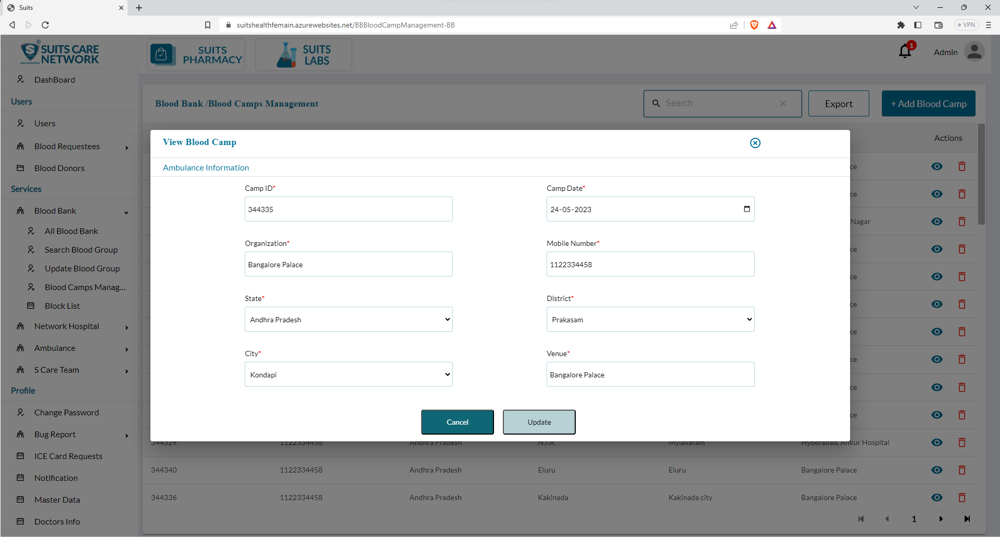

# Blood Bank Management

## All Blood Bank List

Under the blood bank section, there is a page that displays the list of all blood banks available. This page provides an overview of the different blood banks registered within the system.

On this page, the admin has the option to search for specific blood banks using the search functionality. This allows the admin to enter specific search criteria, such as the name of the blood bank or location, and retrieve the corresponding results that match the search query.

Additionally, the admin will find an export option, which allows them to generate a downloadable file or report containing the information from the blood bank list. This exported file provides a comprehensive overview of the blood bank data and can be used for analysis, sharing, or record-keeping purposes.

These features provide the admin with convenient tools to manage and access information related to blood banks within the system. The search functionality allows for quick retrieval of specific blood bank details, while the export option facilitates the extraction and utilization of the blood bank list data as needed.

## Add New Blood Bank

The admin has the option to click on "Add Blood Bank" and will be presented with two methods to add a blood bank: bulk upload and individual upload.

- Bulk Upload: This option allows the admin to upload multiple blood banks simultaneously using a bulk upload feature. Typically, the admin can prepare a file or spreadsheet containing the details of multiple blood banks, such as name, location, contact information, and other relevant data. They can then select this file and upload it to the system, which will automatically add all the blood banks listed in the file.

- Individual Upload: With this option, the admin can manually enter the details of each blood bank one by one. They will be presented with a form or interface where they can input the specific information for each blood bank, such as name, location, contact details, and any other required fields. The admin can fill out the form for each blood bank individually and submit the information to add them to the system.

These two options provide flexibility to the admin in adding blood banks to the system. The bulk upload feature is useful for adding multiple blood banks quickly, while the individual upload option allows for a more detailed and controlled entry of each blood bank's information.

## View/Update Blood Bank

By clicking on the eye icon, the admin can access the details of a specific blood bank and also have the option to update it.

When the admin clicks on the eye icon, a pop-up window or a dedicated page will open, displaying the complete information of the blood bank. This includes details such as the name, location, contact information, services provided, and any other relevant data associated with the blood bank.

Within this pop-up window or page, the admin will typically find an option to update the blood bank's information. By clicking on this update option, the admin can make changes or modifications to the blood bank's details. They can edit fields such as the name, location, contact details, or any other relevant information that needs to be updated.

Once the admin has made the desired changes, they can save the updates, and the blood bank's information will be updated in the system accordingly.

This functionality allows the admin to view and modify the details of a specific blood bank, ensuring that accurate and up-to-date information is maintained within the system.

## Block Blood Bank List

There is a separate page available for the admin to view the list of blocked blood banks. This page specifically displays blood banks that have been blocked for various reasons, such as non-compliance or any other issues.

On this page, the admin can access an overview of all the blocked blood banks, including their names, locations, and reasons for being blocked.

The admin has the ability to unblock a blood bank by selecting the appropriate option. By unblocking a blood bank, the admin reinstates its functionality and allows it to resume normal operations within the system.

Additionally, the admin also has the option to delete a blocked blood bank if necessary. This action permanently removes the blocked blood bank from the system, erasing its details entirely.

These features provide the admin with the necessary tools to manage and address any issues related to blocked blood banks. By having a dedicated page for viewing and managing blocked blood banks, the admin can effectively handle any situations that require unblocking or removing a blood bank from the system.

## All Blood Camp List

The admin can access the Blood Camp Management list, which displays information related to blood camps. This list provides an overview of the various blood camps managed within the system.

Within the Blood Camp Management list, the admin has the ability to utilize a search function. This search feature allows the admin to enter specific search criteria, such as the name or location of a blood camp, to retrieve the corresponding results that match the search query. This facilitates easy access to specific blood camp information as needed.

Furthermore, the admin also has the option to export the Blood Camp Management list. By clicking on the export button, the admin can generate a downloadable file or report containing the information from the Blood Camp Management list. This exported file can be used for analysis, sharing with relevant stakeholders, or record-keeping purposes.

These features of search and export functionality enable the admin to efficiently manage and access information related to blood camps. The search feature allows for quick retrieval of specific blood camp details, while the export option facilitates the extraction and utilization of the Blood Camp Management list data in a convenient format.

## Add New Blood Camp

Once the admin clicks on "Add New Blood Camp," they will have the option to add a blood camp using either bulk upload or individual upload methods.

- Bulk Upload: This method allows the admin to upload multiple blood camps simultaneously using a bulk upload feature. The admin can prepare a file or spreadsheet containing the details of multiple blood camps, such as camp name, location, date, time, and other relevant information. They can then select this file and upload it to the system, which will automatically add all the blood camps listed in the file.

- Individual Upload: With this option, the admin can manually enter the details of each blood camp one by one. They will be presented with a form or interface where they can input specific information for each blood camp, including the camp name, location, date, time, and any other required fields. The admin can fill out the form for each blood camp individually and submit the information to add them to the system.

These two options provide flexibility to the admin in adding blood camps to the system. The bulk upload feature is useful for adding multiple blood camps quickly, while the individual upload option allows for a more detailed and controlled entry of each blood camp's information.

## View/Update Blood Camp

When the admin clicks on the eye icon associated with a specific blood camp, they can view the details of that blood camp. A pop-up window or dedicated page will open, displaying comprehensive information about the blood camp, such as its name, location, date, time, and other relevant details.

Within this pop-up window or page, the admin will typically find an option to update the blood camp's information. By clicking on this update option, the admin can make changes or modifications to the blood camp's details. They can edit fields such as the camp name, location, date, time, or any other relevant information that needs to be updated.

Once the admin has made the desired changes, they can save the updates, and the blood camp's information will be updated in the system accordingly.

This functionality allows the admin to conveniently view and modify the details of a specific blood camp, ensuring that accurate and up-to-date information is maintained within the system.

