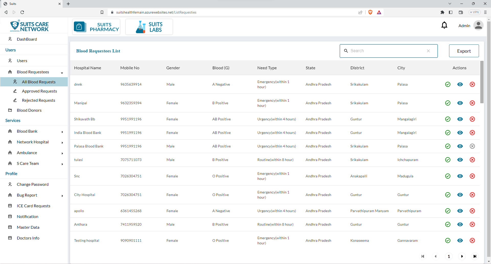
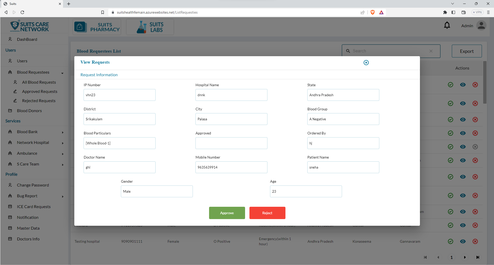
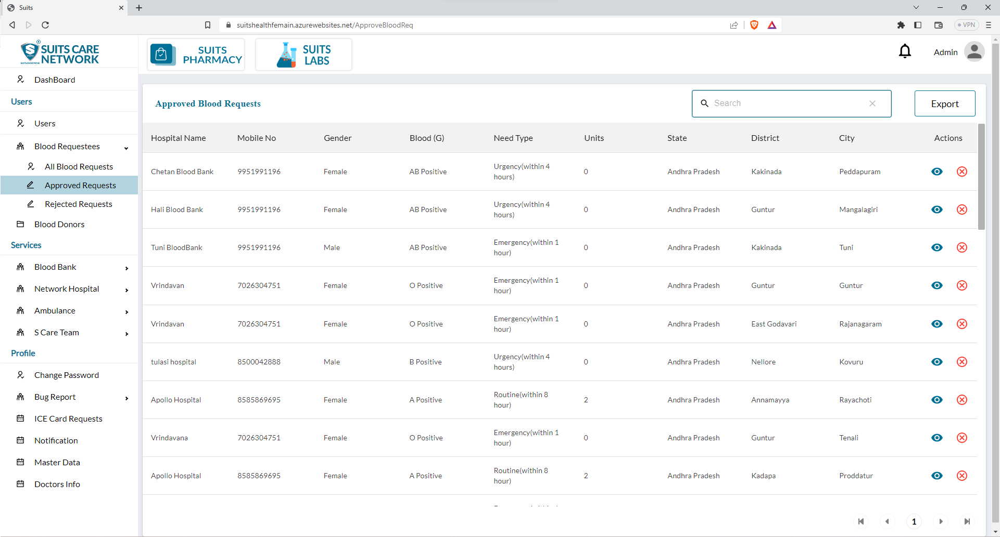
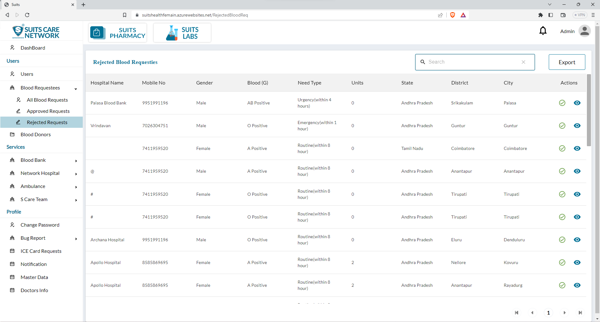

# Blood Request Management

## All Blood Requestees List

When the admin clicks on the "All Blood Requestees" option, they will be able to access a list of all the blood requestees in the system. This list typically includes details such as the hospital name, contact number, and required blood group for each request.

To conveniently search for specific blood requestees, the admin will have a search functionality available. This feature allows the admin to enter specific search criteria, such as a hospital name or blood group, and retrieve the corresponding results that match the search query.

Additionally, the admin will have a separate button to export the table data. By clicking on this button, the admin can generate a downloadable file or report that contains the information from the blood requestees table. This exported file provides a comprehensive overview of the blood requestee data and can be utilized for further analysis, sharing with relevant stakeholders, or record-keeping purposes.

These features provide the admin with efficient tools to manage and access blood requestee information within the system. The search functionality enables quick retrieval of specific data, while the export option allows for easy extraction and utilization of the table data for various purposes.

## Approve/Reject Blood Requestees

The admin has the option to accept or reject the details of any blood requestee for a specific hospital by clicking on the respective "Accept" or "Reject" icon under the action column. This feature allows the admin to review the requestee's information and make a decision regarding their request.

Additionally, the admin can view the specific details of a blood requestee by clicking on the eye icon. This action will open a pop-up window where the admin can access the complete details of the requestee. In this pop-up window, the admin also has the ability to make changes or modifications to the requestee's information if necessary.

Once the admin has made any desired changes, they can click on the "Update" button to save and update the particular details of the blood requestee. This ensures that any modifications made by the admin are accurately reflected in the requestee's record.

These features provide the admin with the ability to manage blood requestees effectively, reviewing and updating their information as needed. The accept/reject functionality allows for efficient processing of requests, while the pop-up view and update options enable the admin to make necessary changes and ensure data accuracy.

## Approved List

We also have a dedicated page where the admin can exclusively view the approved list of blood requestees. This page provides a filtered view that displays only the blood requestees whose requests have been accepted by the admin.

By accessing this specific page, the admin can easily review and monitor the list of approved blood requestees. This feature helps the admin keep track of the requests that have been approved, ensuring that the necessary assistance is provided to those in need of blood.

The approved list of blood requestees typically includes essential details such as the hospital name, contact information, blood group, and any additional relevant information.

This page allows the admin to have a focused view of the approved requests, streamlining the management process and facilitating efficient coordination with hospitals and potential blood donors.

## Rejected List

We have a separate page dedicated to viewing the list of rejected blood requestees. This page displays only those blood requestees whose requests have been rejected by the admin.

By navigating to this page, the admin can access a comprehensive list of all the rejected blood requestees. This list typically includes details such as the hospital name, contact number, blood group, and the reason for rejection.

The purpose of having a dedicated page for the rejected list is to provide easy access and visibility to the admin regarding the requests that were declined. This allows the admin to review the rejected requests, analyze the reasons for rejection, and take any necessary actions or follow-up steps accordingly.

Having a separate page specifically for the rejected list helps the admin to effectively manage and track the status of blood requests, ensuring that appropriate decisions are made and documented for each requestee.

