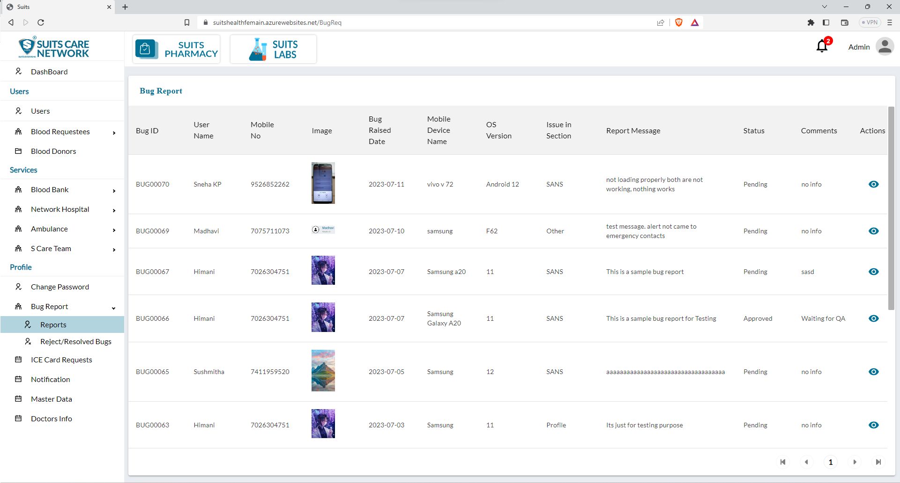
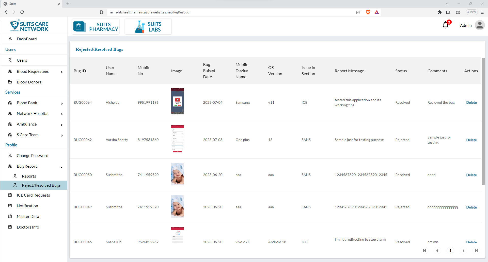

# Bug Report Management

## All Bug Report List

The admin has access to a page that displays the list of all bug reports within the system. This page provides an overview of the reported bugs, issues, or glitches encountered by users of the system.

## View/Approve Bug Report

When the admin clicks on the eye icon associated with a specific bug report, they can view detailed information about that particular bug. This action will open a pop-up window or dedicated page, displaying important details such as the Bug ID, comments, and the current status of the bug.

## View/Reject Bug Report

All the rejected or resolved bugs are typically listed on a separate page dedicated to displaying the status of resolved or rejected bug reports.

On this page, the admin can view a comprehensive list of all the bugs that have been either rejected or marked as resolved. The list will include details such as the Bug ID, description, comments, resolution status, and any other relevant information.

Having a separate page for rejected or resolved bugs allows the admin to easily track and manage these bug reports. It provides a centralized location to review the status and outcomes of reported issues, helping to ensure proper documentation and follow-up on bug resolutions or rejections.

By accessing this page, the admin can review the details of rejected or resolved bugs, analyze the reasons for rejection or resolution, and take any necessary actions or follow-up steps if required. This helps in maintaining a well-organized bug tracking system and promoting effective bug management within the system.

