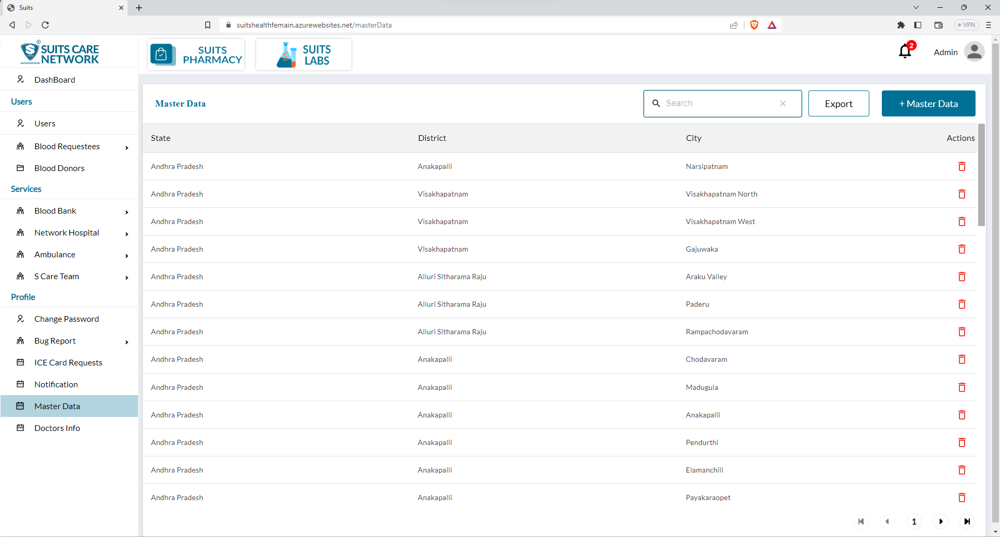
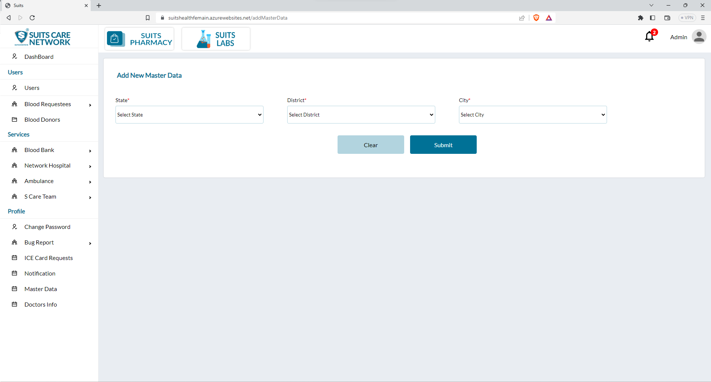
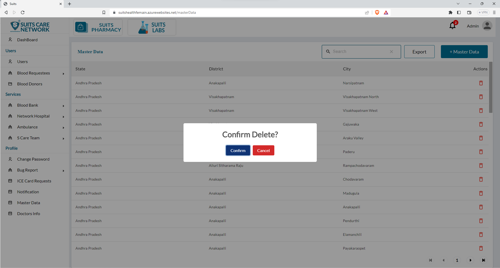

# Master Data Management

## All Master Data List

The administrator has privileged access to a centralized master data list that encompasses all the state, district, and city information that has been enabled or made available by the administrator. This list serves as a comprehensive repository of geographical data.

Within this master data list, the administrator is equipped with a search functionality. This allows them to effortlessly locate specific entries or subsets of data based on their requirements. By inputting relevant search criteria, such as a state name, district name, or city name, the administrator can quickly retrieve the desired information from the list.

Additionally, the administrator possesses the ability to export the master data list. This means they can generate a downloadable file or document containing the entire list or a filtered subset of data. This export feature facilitates the utilization of the data in various formats, such as spreadsheets or other applications, for further analysis, reporting, or integration into other systems.

## Add New Master Data

The administrator has the authority to enable or activate any city within the master data by selecting it from the available list. This means that the administrator has the ability to mark a specific city as "active" within the system.

By choosing a city from the list, the administrator indicates that it should be included and considered in the overall data set and relevant operations or processes. This enables the city to be visible and accessible for various purposes, such as searching, reporting, or performing actions that involve that particular city's data.

## Delete Master Data

If the administrator decides to disable a city that they have previously selected, users will have the option to click on a delete icon associated with that particular master data entry. By clicking on the delete icon, users can initiate the deletion process for the specific city in question. This action will remove the city's data from the master data list and any associated records or references tied to that city will be updated accordingly.

Deleting a city from the master data list means that it will no longer be considered as an active or enabled city within the system. Users will no longer be able to access or utilize the data associated with that city. It's important to note that the deletion process is irreversible, and once a city is deleted, its data cannot be easily recovered unless it has been backed up or archived prior to deletion.

