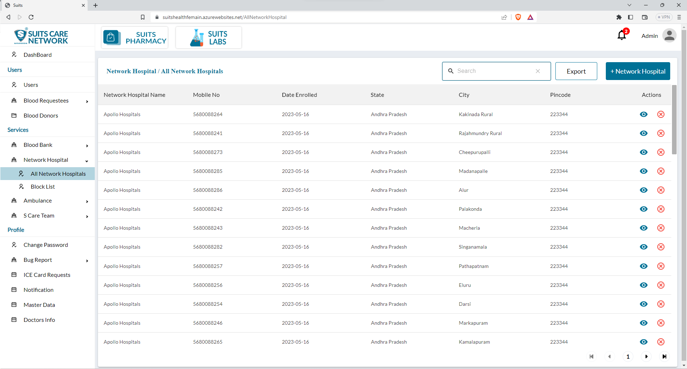
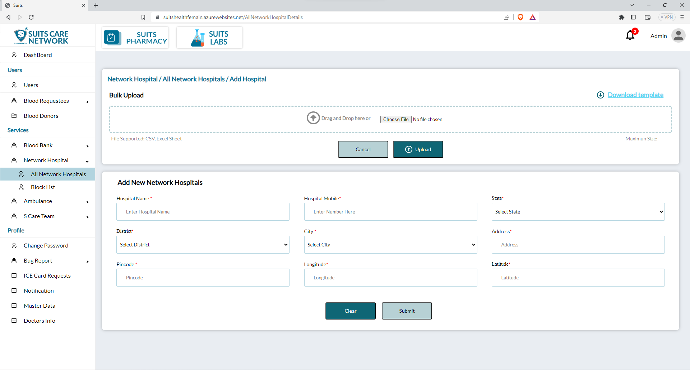
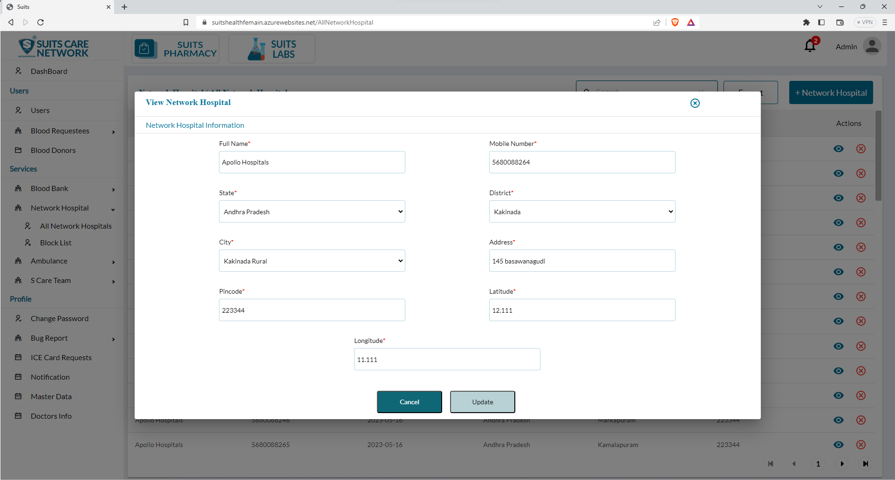
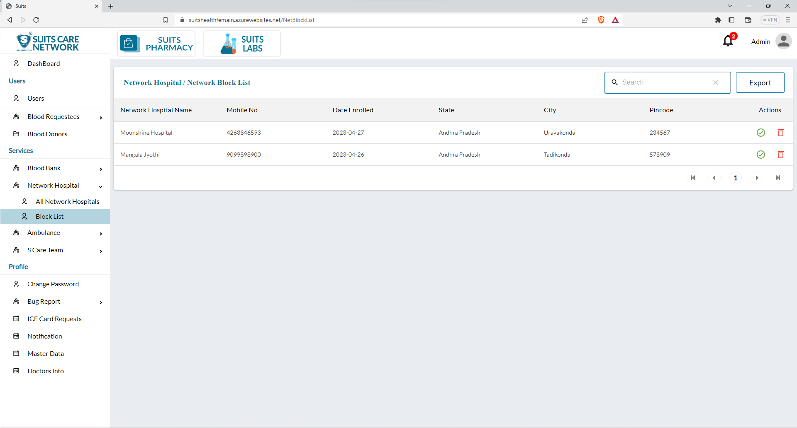

# Network Hospital Management

## All Network Hospital

The admin has the ability to access the list of all network hospitals. This page provides an overview of the hospitals that are part of the network within the system.

On this page, the admin can utilize the search functionality to search for specific network hospitals. By entering specific search criteria such as the hospital name or location, the admin can retrieve the corresponding results that match the search query. This makes it easier to find specific hospitals within the network.

Additionally, the admin also has the option to export the network hospital list. By clicking on the export button, the admin can generate a downloadable file or report containing the information from the network hospital list. This exported file can be used for analysis, sharing with relevant stakeholders, or record-keeping purposes.

These features of search and export functionality provide the admin with efficient tools to manage and access information related to network hospitals. The search option enables quick retrieval of specific hospital details, while the export feature facilitates the extraction and utilization of the network hospital list data in a convenient format.

## Add New Network Hospital

The admin has the option to add a new network hospital through either bulk upload or individual upload methods.

Bulk Upload: Using the bulk upload feature, the admin can upload multiple network hospitals simultaneously. They can prepare a file or spreadsheet containing the details of multiple hospitals, including names, locations, contact information, and any other relevant data. By selecting this file, the admin can upload it to the system, which will automatically add all the hospitals listed in the file to the network.

Individual Upload: Alternatively, the admin can add a new network hospital by manually entering its details one by one. They will be presented with a form or interface where they can input specific information such as the hospital name, location, contact details, and any other required fields. The admin can fill out the form for each hospital individually and submit the information to add them to the network.

These options provide flexibility to the admin in adding new network hospitals to the system. The bulk upload feature is useful for quickly adding multiple hospitals, while the individual upload option allows for more detailed and controlled entry of each hospital's information.

## View/Update Network Hospital

When the admin clicks on the eye icon associated with a specific network hospital, they can view the details of that hospital. This action will open a pop-up window or dedicated page, displaying comprehensive information about the network hospital, such as its name, location, contact details, and other relevant information.

Within this pop-up window or page, the admin will typically find an option to update the network hospital's details. By clicking on this update option, the admin can make changes or modifications to the hospital's information. They can edit fields such as the hospital name, location, contact details, or any other relevant information that needs to be updated.

Once the admin has made the desired changes, they can save the updates, and the network hospital's information will be updated in the system accordingly.

This functionality allows the admin to conveniently view and modify the details of a specific network hospital, ensuring that accurate and up-to-date information is maintained within the system.

## Blocked Network Hospital List

The admin has the option to block a network hospital, which temporarily restricts its access or participation within the system. When a network hospital is blocked, it will be listed on a separate page specifically dedicated to blocked network hospitals.

By blocking a network hospital, the admin can effectively limit its functionalities within the system for various reasons, such as non-compliance, policy violations, or other issues that require temporary suspension.

On the Blocked Network Hospital page, the admin can view a comprehensive list of the blocked network hospitals. This list typically includes details such as the hospital name, location, contact information, and the reason for blocking.

Having a dedicated page for blocked network hospitals allows the admin to easily manage and keep track of network hospitals that have been temporarily suspended. The admin can review the blocked hospitals, take necessary actions, and monitor their status to ensure compliance with the system's policies and standards.

