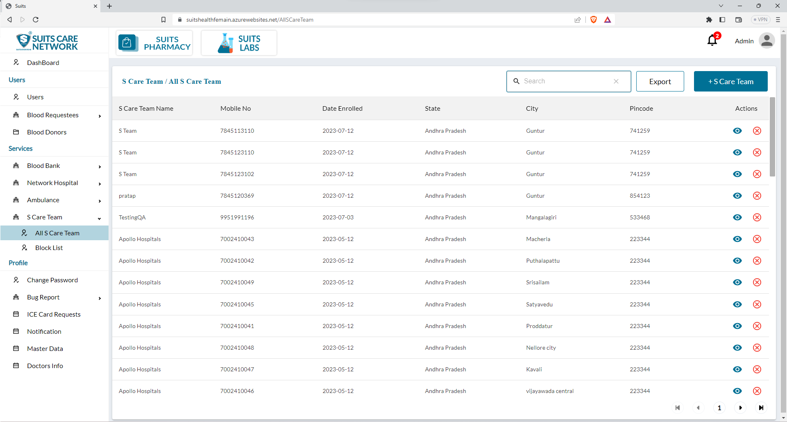
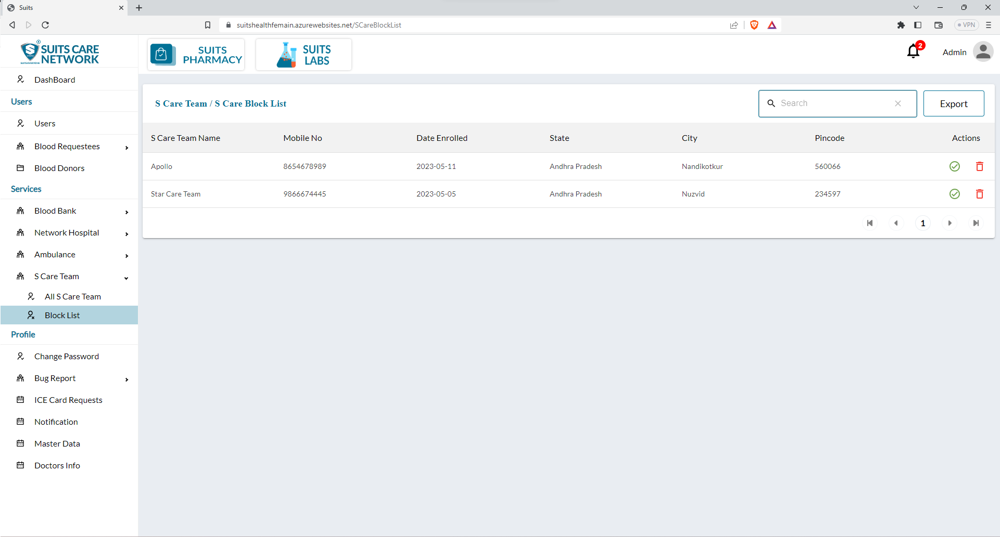

# S Care Team Management

## All S Care Team

The admin has access to a page where they can view the list of all S Care Teams within the system. This page provides an overview of the S Care Teams registered in the system.

On this page, the admin has the ability to utilize a search functionality. This search feature allows the admin to enter specific search criteria, such as the team name, location, or any other relevant details, and retrieve the corresponding results that match the search query. This makes it easier to find specific S Care Teams within the list.

Furthermore, the admin also has the option to export the S Care Team list. By clicking on the export button, the admin can generate a downloadable file or report containing the information from the S Care Team list. This exported file can be used for analysis, sharing with relevant stakeholders, or record-keeping purposes.

These features of search and export functionality provide the admin with efficient tools to manage and access information related to S Care Teams. The search option allows for quick retrieval of specific team details, while the export feature facilitates the extraction and utilization of the S Care Team list data in a convenient format.

## Add New S Care Team

The admin has the option to add a new S Care Team to the system using either bulk upload or individual upload methods.

1. Bulk Upload: With the bulk upload feature, the admin can upload multiple S Care Teams simultaneously. They can prepare a file or spreadsheet containing the details of multiple teams, including their names, locations, contact information, and any other relevant data. By selecting this file, the admin can upload it to the system, which will automatically add all the S Care Teams listed in the file.

2. Individual Upload: Alternatively, the admin can add a new S Care Team by manually entering its details one by one. They will be presented with a form or interface where they can input specific information, such as the team name, location, contact details, and any other required fields. The admin can fill out the form for each S Care Team individually and submit the information to add them to the system.

These options provide flexibility to the admin in adding new S Care Teams to the system. The bulk upload feature is useful for quickly adding multiple teams, while the individual upload option allows for more detailed and controlled entry of each team's information.

## View/Update S Care Team

When the admin clicks on the eye icon associated with a specific S Care Team, they can view the details of that team. This action will open a pop-up window or dedicated page, displaying comprehensive information about the S Care Team, such as its name, location, contact details, and other relevant information.

Within this pop-up window or page, the admin will typically find an option to update the S Care Team's details. By clicking on this update option, the admin can make changes or modifications to the team's information. They can edit fields such as the team name, location, contact details, or any other relevant information that needs to be updated.

Once the admin has made the desired changes, they can save the updates, and the S Care Team's information will be updated in the system accordingly.

This functionality allows the admin to conveniently view and modify the details of a specific S Care Team, ensuring that accurate and up-to-date information is maintained within the system.

## Block S Care Team

The admin has the option to block an S Care Team, which temporarily restricts its access or functionality within the system. When an S Care Team is blocked, it will be listed on a separate page specifically dedicated to blocked S Care Teams.

By blocking an S Care Team, the admin can effectively limit its operations within the system for various reasons, such as non-compliance, policy violations, or other issues that require temporary suspension.

On the Blocked S Care Team page, the admin can view a comprehensive list of the blocked S Care Teams. This list typically includes details such as the team name, location, contact information, and the reason for blocking.

Having a dedicated page for blocked S Care Teams allows the admin to easily manage and keep track of teams that have been temporarily suspended. The admin can review the blocked teams, take necessary actions, and monitor their status to ensure compliance with the system's policies and standards.

