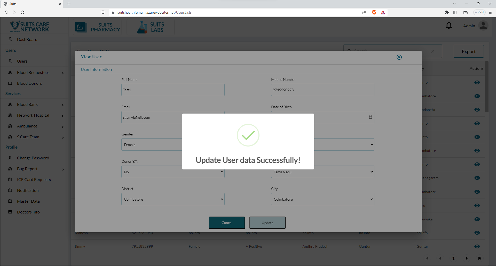

# User Management

## All Users

When the admin logs in to the Suits Network Care system, they will have the ability to access and view the details of all users. This includes information such as user profiles, account details, and any relevant data associated with each user.

- To conveniently search for specific user details, the admin will have a search feature at their disposal. This functionality allows the admin to enter search criteria, such as a user's name, ID, or any other identifying information, and retrieve the corresponding user details quickly and efficiently.

- Additionally, the admin will have the option to export the table details. This means they can generate a downloadable file or report that contains the information from the user table. By exporting the table details, the admin can obtain a comprehensive overview of user data in a format that can be easily shared or analyzed outside the system.

- These features provide the admin with the necessary tools to manage and analyze user information within the Suits Network Care system, enabling efficient user search and the ability to extract and utilize user data as needed.

## Update/View User

Once the admin clicks on the "Eye" icon under Actions section, they will be able to access and view the detailed information of a specific user. This includes all relevant details associated with the user's profile, such as their personal information, contact details, account settings, and any other relevant data.

In addition to viewing the user details, the admin will also have the option to edit them. This means they can make changes or modifications to the user's information as required. This editing capability allows the admin to update user profiles, correct any errors, or incorporate any changes provided by the user.

By having the ability to view and edit user details, the admin can ensure that the user information remains accurate, up-to-date, and aligned with the system's requirements. It empowers the admin to manage user data effectively and provide necessary updates or adjustments whenever necessary.

Once the admin updates the fields with the desired changes, they can click on the "Update" button to save and apply the modifications. Clicking the "Update" button triggers the system to process and save the updated information, ensuring that the changes made by the admin are reflected in the user's profile.

After clicking the "Update" button, the system will validate the changes and update the corresponding fields accordingly. The updated information will be stored securely within the system's database, ensuring that the user's profile is now updated with the new data.

This update process allows the admin to effectively manage user details and ensure the accuracy and relevance of the information stored within the system. It enables the admin to maintain an up-to-date database and provide users with accurate and current information associated with their accounts.

