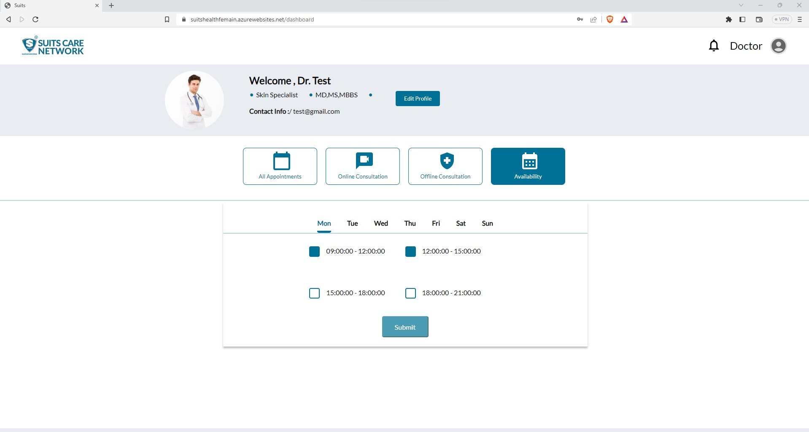
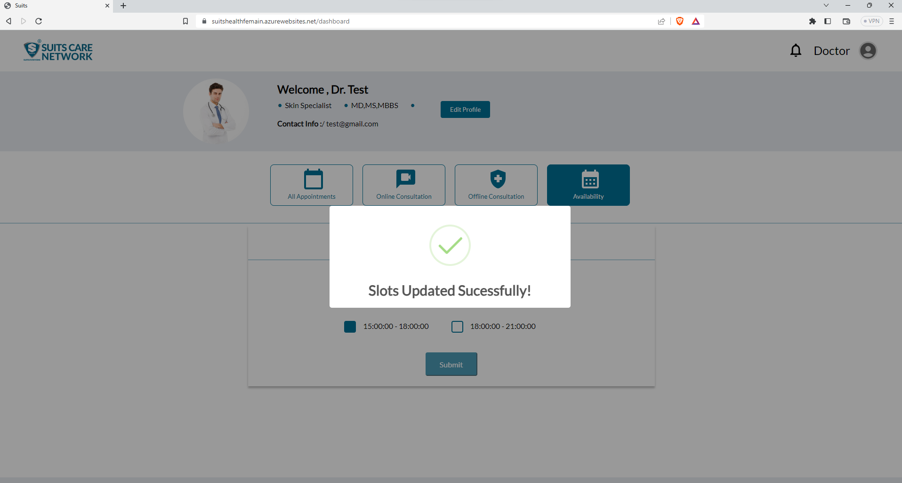

# Schedule Doctor Availability

When a doctor is on the dashboard page and clicks on the "Availability" option, they can access the timings during which they will be available for appointments. This feature allows doctors to view their current availability schedule.

## View Schedule Availability

## Add Availability

Additionally, the doctor has the ability to update their availability based on their preferences. They can modify the timings to reflect their desired working hours, availability for specific appointment types, and any other relevant scheduling preferences.

By having the option to update their availability, doctors can effectively manage their schedule and ensure that patients can easily book appointments during the designated times. This feature offers flexibility and convenience for doctors to adjust their availability according to their personal and professional commitments.

## Remove Availability

In addition to being able to update their availability, the doctor will also have the option to remove or delete their availability if needed. This allows the doctor to modify their schedule and remove specific time slots or periods during which they will not be available for appointments.

By removing availability, the doctor communicates to patients and the system that they are not open for appointments during those particular time slots. This can be useful when the doctor has personal or professional commitments, or if they need to temporarily pause or block off specific times in their schedule.

Having the ability to remove availability provides doctors with flexibility in managing their time and ensures that patients can only book appointments during the periods when the doctor is actively available.

