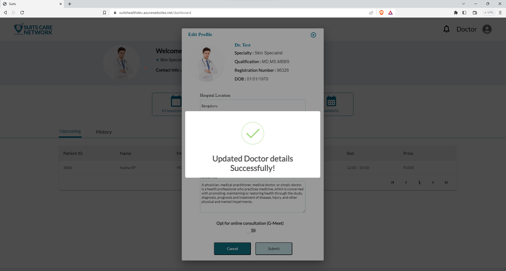

# Product Management

## Dashboard

    The Doctor Dashboard page containes Doctor details with the specialization of the doctor and his experiance .
    Doctor will have 4 main menues where he can view the detials from respective patients

```bash
Hello

```

This guide is derived from [Qt without Xcode how-to][gist] by Peter Jonas ([shoogle]) / [CC BY 4.0][CC-BY]

[gist]: https://gist.github.com/shoogle/750a330c851bd1a924dfe1346b0b4a08 "GitHub gist"
[shoogle]: https://github.com/shoogle "shoogle's GitHub user profile"

[![Creative Commons License][CC-BY-image]][CC-BY]

This work is licensed under a [Creative Commons Attribution 4.0 International License][CC-BY].

[CC-BY]: http://creativecommons.org/licenses/by/4.0/ "View license text on the Creative Commons website"
[CC-BY-image]: https://i.creativecommons.org/l/by/4.0/88x31.png "CC BY"


## View/Update Profile



