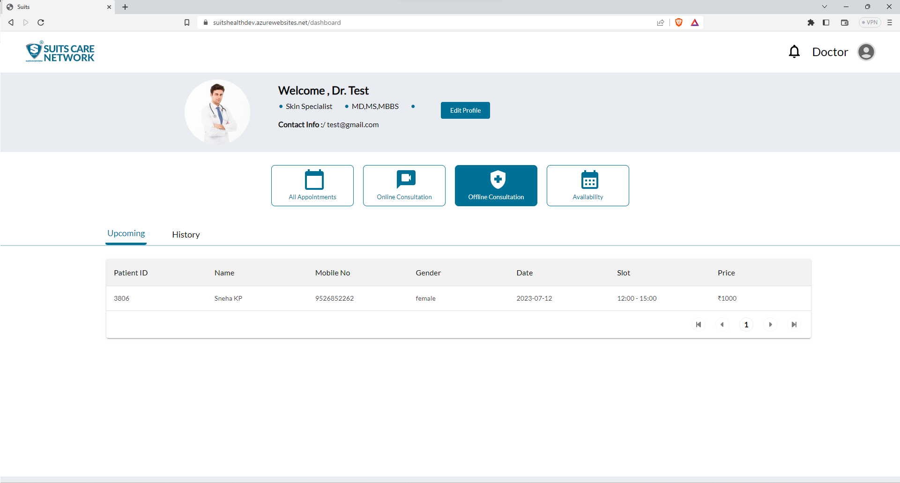

# View Appointmnets

Once a doctor clicks on the "All Appointments" menu, they will have access to three sub-menus: "Today's List," "Upcoming List," and "History List."

The "Today's List" displays all the appointments, both online and offline, that are scheduled for the current day. This allows the doctor to see a comprehensive list of patients they are expected to attend to on that particular day, regardless of the appointment type.

The "Upcoming List" provides the doctor with a view of all future appointments. This list includes all scheduled appointments that are yet to occur, allowing the doctor to plan their schedule accordingly and prepare for upcoming consultations or treatments.

The "History List" offers a record of past appointments. Here, the doctor can access details and information about previous consultations, enabling them to review the medical history, treatments provided, and any notes or follow-ups associated with those appointments.

These three lists within the "All Appointments" menu provide doctors with a convenient way to manage their schedule, stay organized, and have easy access to patient information based on the different appointment statuses.

## Online appointments

Once a doctor clicks on the Online Consultation, they will have access to two sub-menus: "Upcomming" and "History"

The "Upcoming List" provides the doctor with a view of all future Online appointments. This list includes all scheduled appointments that are yet to occur, allowing the doctor to plan their schedule accordingly and prepare for upcoming consultations or treatments.

The "History List" offers a record of past Online appointments. Here, the doctor can access details and information about previous consultations, enabling them to review the medical history, treatments provided, and any notes or follow-ups associated with those appointments.

## Offline appointments

Once a doctor clicks on the Offline Consultation, they will have access to two sub-menus: "Upcomming" and "History"

The "Upcoming List" provides the doctor with a view of all future Offline appointments. This list includes all scheduled appointments that are yet to occur, allowing the doctor to plan their schedule accordingly and prepare for upcoming consultations or treatments.

The "History List" offers a record of past Offline appointments. Here, the doctor can access details and information about previous consultations, enabling them to review the medical history, treatments provided, and any notes or follow-ups associated with those appointments.

