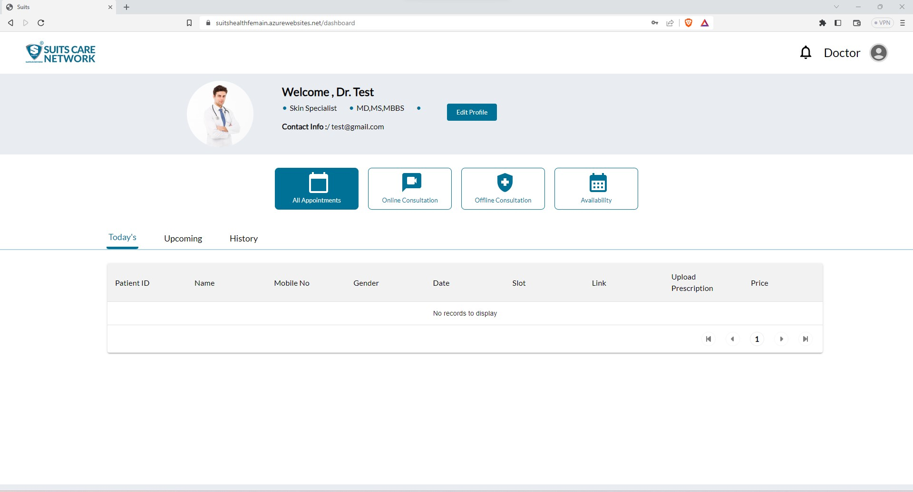
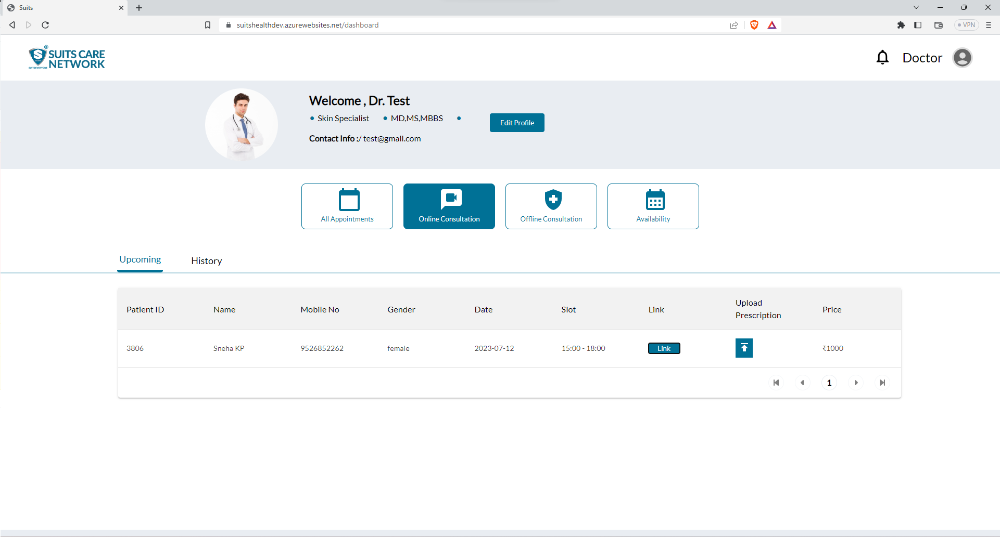
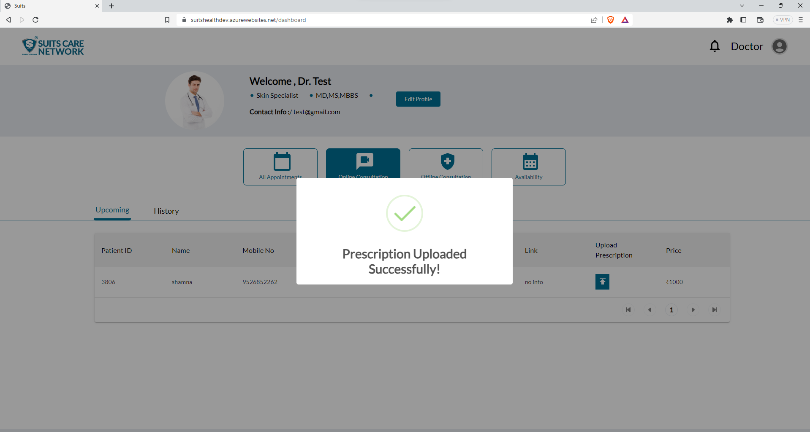

# Join a Virtual Consultaion

When the doctor navigates to the Online Consultation tab, they will be able to see a list of their upcoming virtual consultations. This tab provides a dedicated space for the doctor to manage and organize their online consultation appointments. It typically displays essential information such as the date, time, and patient details for each scheduled virtual consultation.

## Join Video Call

Doctors will have the option to join any scheduled meeting by using the provided link. When they have an upcoming virtual consultation or online meeting, they will receive a specific link that allows them to join the meeting at the designated time.

By clicking on the provided link, the doctor will be directed to the virtual meeting platform in our case it is G-Meet platform. This link serves as the access point for the doctor to enter the meeting room and connect with the patient or other participants.

Having the option to join meetings using the provided link makes it convenient for doctors to seamlessly join virtual consultations without the need for additional steps or complicated setup procedures. It simplifies the process and ensures that doctors can easily connect and engage in the scheduled online meetings.

# Upload a Prescription

After the meeting is concluded, the doctor will have the option to upload the prescription. This feature allows the doctor to provide the patient with a digital copy of the prescription or any related medical documents.

To upload the prescription, the doctor will typically navigate to a designated section or feature within the online consultation platform or dashboard. They can then select the appropriate option to upload the prescription file from their device, such as a computer or smartphone.

Upon successfully uploading the prescription, it will be securely stored and made available for the patient to access. This digital prescription can serve as a convenient record for the patient, eliminating the need for physical copies and facilitating easier retrieval and tracking of medical information.

By offering the option to upload prescriptions, doctors can efficiently deliver the necessary documentation to patients after the consultation, ensuring seamless continuity of care and facilitating accurate medication management.

