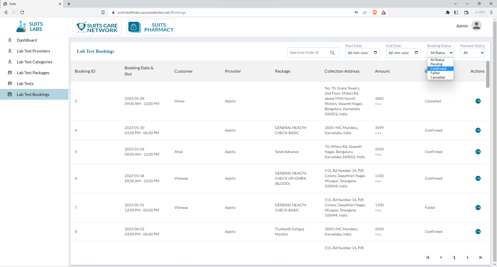
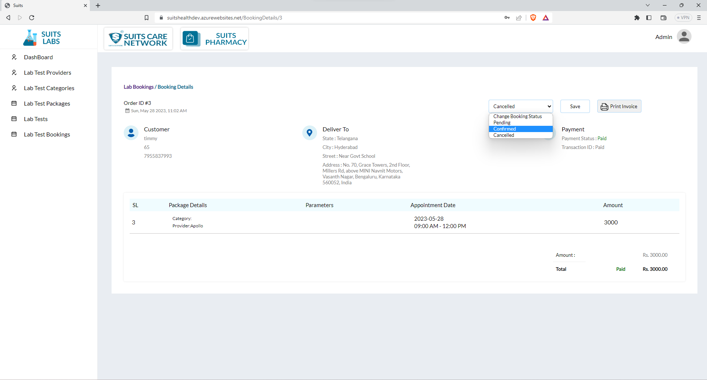
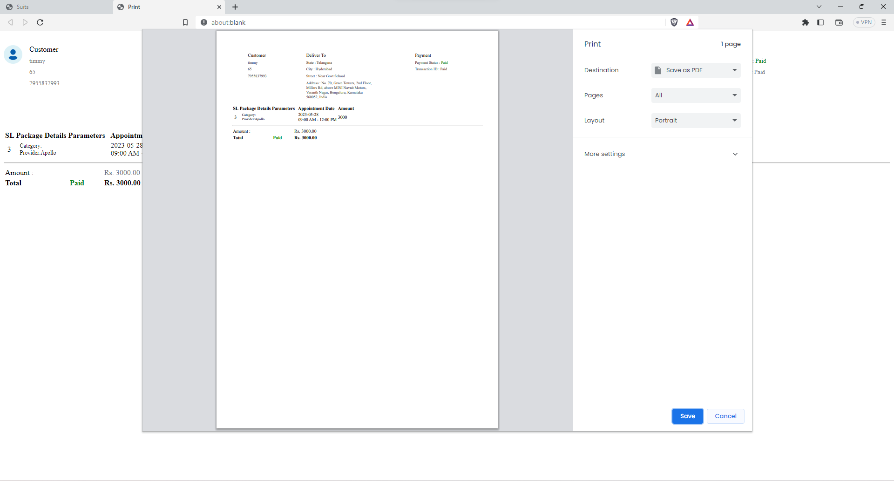

# Lab Test Bookings Management

## Lab Test Bookings List

The Lab Test Booking List is presented in a table format and includes various columns such as Booking ID, Date and Slot, Customer, Provider, Package, Address, Amount, and Booking Status as the main headings.

The admin has several options to search and filter the bookings based on different criteria:

1. Search by Booking ID: The admin can enter a specific Booking ID to quickly locate a particular booking in the list.

2. Filter by Start Date and End Date: The admin can select a start date and an end date to filter the bookings within a specific time range. This helps in viewing bookings made within a particular period.

3. Filter by Booking Status: The admin can choose from various booking status options such as "Pending," "Confirmed," "Failed," or "Cancelled." By selecting one or multiple status options, the admin can filter the bookings based on their current status.

4. Filter by Payment Status: The admin can filter bookings based on their payment status, which can include options like "Paid," "Unpaid," or "Failed." By selecting one or multiple payment status options, the admin can filter the bookings accordingly.

By using these search and filter options, the admin can efficiently navigate and manage the Lab Test Booking List based on specific criteria. This allows for streamlined tracking of bookings, analysis of payment statuses, and efficient handling of various booking statuses.

## View Lab Test Bookings

Upon clicking on the view icon in the Lab Test Booking Details section, the admin can access comprehensive information related to a specific booking.

Within the booking details page, the admin will have visibility into various aspects, including customer details, delivery address, payment information (including transaction ID), package details, parameters, appointment date, and the amount.

The admin can review the customer details, such as name and contact information, to ensure accurate and up-to-date information. They can also view the delivery address to confirm the correct location for the lab test.

Additionally, the admin can access payment details, including the transaction ID, to verify the payment status and track any relevant financial information associated with the booking.

The package details section provides a comprehensive overview of the selected lab test package, including the parameters or tests included in the package. This allows the admin to review the specific tests requested by the customer.

Furthermore, the admin can view the appointment date, allowing them to ensure the availability of resources and schedule necessary arrangements for conducting the lab tests.

After reviewing the details, the admin can update the status of the booking. The available status options usually include "Pending," "Confirmed," and "Cancelled." By selecting the appropriate status, the admin can accurately reflect the progress or outcome of the booking.

This functionality provides the admin with the necessary tools to manage and track lab test bookings effectively, ensuring a streamlined and organized process.

## Print Lab Test Bookings Details

Certainly! In addition to the mentioned features, the admin also has the capability to print the invoice and view the downloaded details of the booking page.

When the admin is viewing the lab test booking details, they can initiate the printing process by clicking on the print icon or utilizing a dedicated print function. This action generates a printable version of the invoice, allowing the admin to obtain a physical or digital copy for documentation purposes.

Furthermore, the admin can choose to download the details of the booking page. By clicking on the download icon or using a relevant download option, the admin can save the booking details as a file or document on their device. This enables the admin to have offline access to the information or store it for future reference or analysis.

These features of printing the invoice and downloading the booking details provide the admin with flexibility and convenience in managing and archiving the necessary documentation related to lab test bookings.

