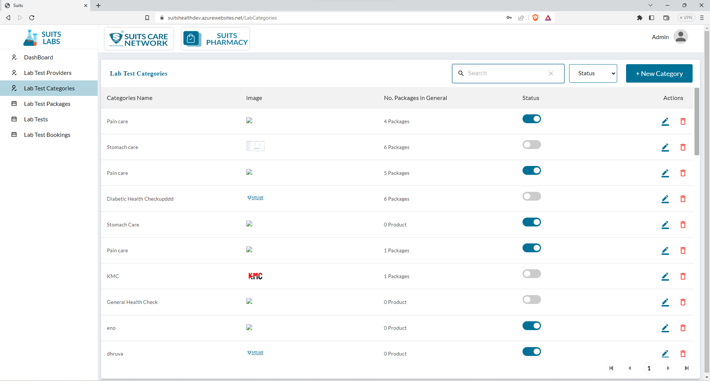
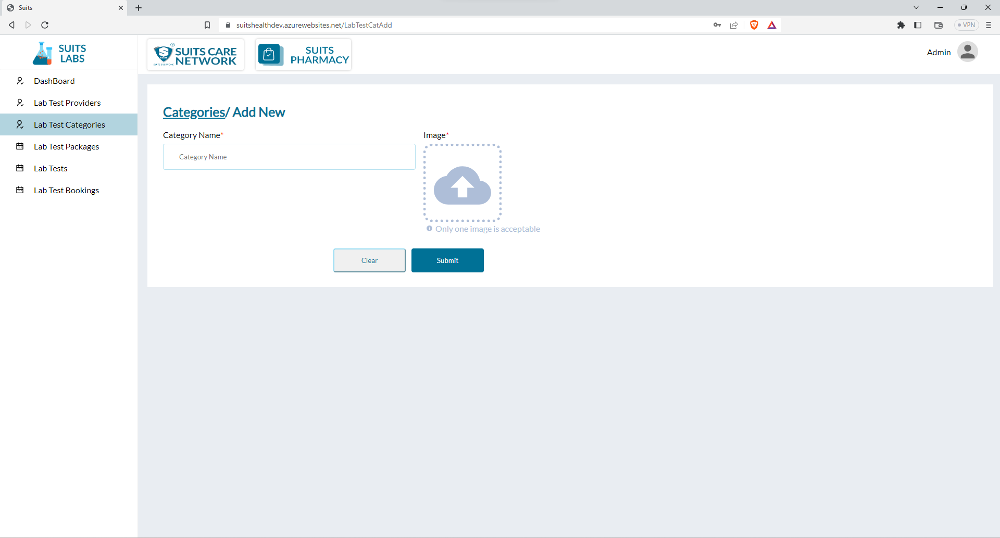

# Lab Test Category Management

## Lab Test Category List

The Lab Test Category List displays various details in a table format, including the Category Name, associated image, the number of packages available in general for each category, and the status of each category.

The admin has the ability to search for specific categories by entering the Category Name into the search function. This search functionality allows the admin to quickly locate and access the desired lab test category within the list.

Additionally, the admin can filter the lab test categories based on their status, which can be classified as "Active" or "Inactive." By selecting the respective filter option, the admin can refine the displayed list to show only the lab test categories that match the chosen status. This filtering feature aids in organizing and managing lab test categories based on their availability or operational status.

By utilizing the search and filter options, the admin can efficiently navigate and interact with the Lab Test Category List, making it easier to find specific categories and perform relevant administrative tasks as necessary.

## Add New Lab Test Category

The admin has the capability to add a new lab test category by providing the category name and image:

1. Access the lab test category management section or the "Add New Category" page.
2. Fill in the necessary details for the new category, typically including:

   - Category Name: Enter the name or title of the lab test category.
   - Image: Upload an image associated with the category, which can help visually represent or identify the category.
   - Other relevant details: Depending on the specific system or requirements, there may be additional fields or details to fill in, such as a description or any specific settings for the category.

3. Once the category name and image (if applicable) are provided, click on the "Save" or "Add Category" button to store the new lab test category in the system.

By following these steps and providing the necessary information, the admin can successfully add a new lab test category. This enables the inclusion of the category in the lab test category list, allowing users to select and access the relevant tests or packages associated with that category.

## View/Update Lab Test Category

To update a new lab test category with the category name and image, the admin can follow these steps:

1. Access the lab test category management section or the "Add New Category" page.
2. Identify the form or fields where the category details can be modified.
3. Locate the field for the category name and update it with the desired changes.
4. If there is an option to update the category image, the admin can either upload a new image or select a new image from the available choices.
5. Once the necessary updates have been made, save the changes by clicking the "Save" or "Update" button.

By following these steps, the admin can successfully update the lab test category with the new category name and image. This allows for accurate representation and effective categorization of lab test categories within the system.

## Delete Lab Test Category

Indeed, the admin has the ability to delete a lab test category by clicking on the delete icon associated with that category.

To delete a lab test category, the admin can follow these steps:

1. Locate the specific lab test category within the list that needs to be deleted.
2. Identify the delete icon linked to that category.
3. Click on the delete icon, which will trigger a confirmation prompt or dialog box to ensure the deletion is intentional.
4. Confirm the deletion when prompted to proceed with removing the lab test category from the system.
5. Once confirmed, the lab test category, along with any associated data or records, will be permanently deleted from the system.

It is important to exercise caution when deleting a lab test category, as the process is typically irreversible. Ensure that the deletion is intended and that any necessary backups or precautions have been taken.

By utilizing the delete icon, the admin can effectively manage the lab test categories by removing categories that are no longer relevant, required, or appropriate within the system.

