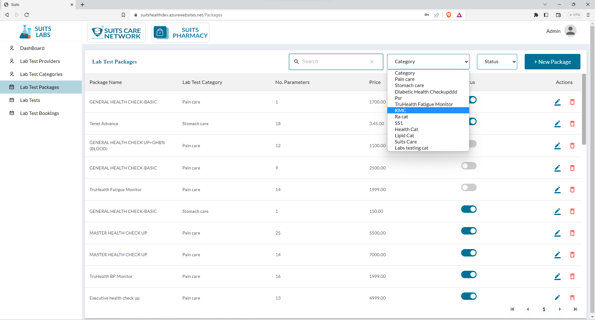
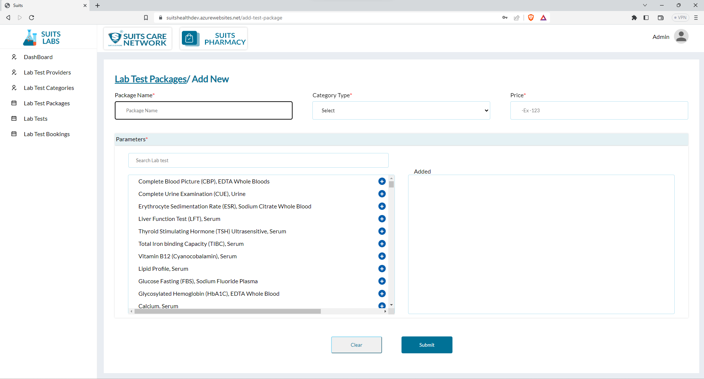
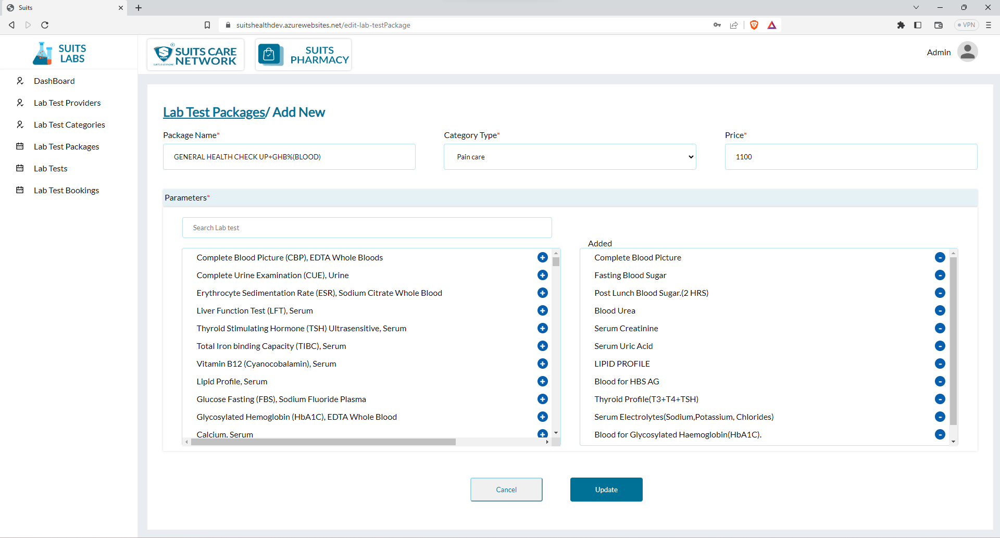
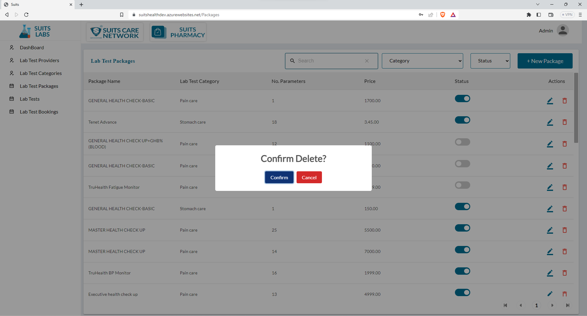

# Lab Test Packages Management

## Lab Test Packages List

In the Lab Test Packages section, the admin can view a list of packages that includes various details such as Package name, Lab Test categories associated with each package, the number of parameters included in the package, price, and status.

The admin has the ability to search for specific packages by entering the Package name into the search function. This search functionality allows the admin to quickly locate and access the desired lab test package within the list.

Additionally, the admin can filter the package list based on Lab Test categories. By selecting a specific category from the provided list of categories, the admin can filter the displayed packages to show only those that belong to the chosen category. This filtering feature assists in organizing and managing lab test packages based on their respective categories.

Moreover, the admin can filter the table list based on the status of the packages. The available options for status are typically "Active" and "Inactive." By selecting the desired status option, the admin can filter the list to display only the packages that match the chosen status. This filtering capability aids in managing and analyzing packages based on their current availability or operational status.

By utilizing the search and filter options, the admin can efficiently navigate and interact with the Lab Test Packages list, making it easier to find specific packages and perform relevant administrative tasks as necessary.

## Add New Lab Test Packages

To add a new lab test package, the admin can follow these steps:

1. Access the lab test package management section or the "Add New Package" page.
2. Fill in the necessary details for the package:
   - Package Name: Enter a unique name or title for the package.
   - Category Type: Select the lab test category or categories that the package belongs to. This helps in organizing and classifying the package.
   - Price: Specify the price or cost of the package.
3. After providing the basic package details, the admin can proceed to add lab test parameters to the package. This can typically be done by clicking on an "Add Parameter" button or a similar option.
4. For each parameter, the admin will need to enter the parameter name, range, unit, or any other relevant details.
5. Once all the parameters have been added, save the package by clicking the "Save" or "Add Package" button.

By following these steps, the admin can successfully add a new lab test package to the system. This allows for the creation and management of packages with specific names, associated categories, prices, and lab test parameters.

## View/Update Lab Test Packages

To update lab test packages, the admin can make changes to the package name, category type, price, and also update lab test parameters. Here's how the admin can perform these updates:

1. Locate the specific lab test package that requires updating within the list.
2. Click on the package name or an "Edit" icon associated with that package.
3. This action will take the admin to a page or form where they can modify the package details.
4. In the form, find the field for the package name and update it with the desired changes.
5. If there is an option to update the category type, select the appropriate category from the provided options or update it based on the revised categorization.
6. Similarly, update the price field with the new pricing information for the package.
7. To update lab test parameters, navigate to the relevant section or tab within the update form.
8. Add, remove, or modify lab test parameters as needed, such as adding new parameters, removing existing ones, or updating parameter details.
9. Once the necessary changes have been made, save the updated details by clicking the "Save" or "Update" button.

By following these steps, the admin can successfully update lab test packages by modifying the package name, category type, price, and lab test parameters. These updates ensure that the package details accurately reflect any changes, such as revised names, updated pricing, or modified parameters.

## Delete Lab Test Packages

The admin can delete a lab test package by clicking on the delete icon associated with that particular package.

To delete a lab test package, the admin can follow these steps:

1. Locate the specific lab test package within the list that needs to be deleted.
2. Identify the delete icon linked to that package.
3. Click on the delete icon, triggering a confirmation prompt or dialog box to ensure the deletion is intentional.
4. Confirm the deletion when prompted to proceed with removing the lab test package from the system.
5. Once confirmed, the lab test package, along with any associated data or records, will be permanently deleted from the system.

Please exercise caution when deleting a lab test package, as the process is typically irreversible. Ensure that the deletion is intended and that any necessary backups or precautions have been taken.

By utilizing the delete icon, the admin can effectively manage the lab test packages by removing packages that are no longer relevant, required, or appropriate within the system.

