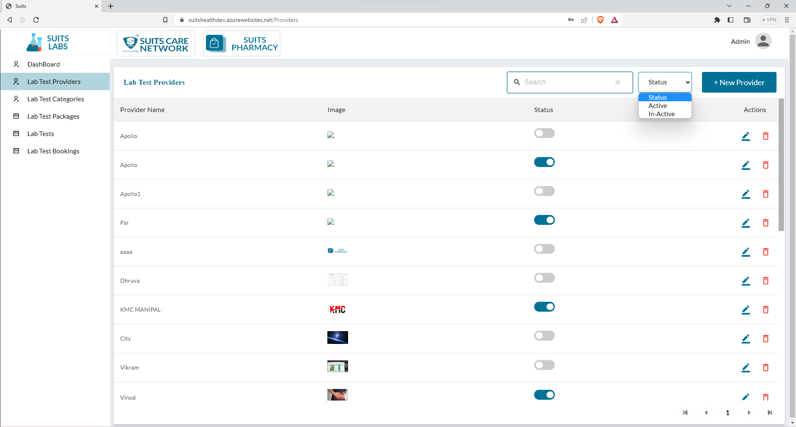
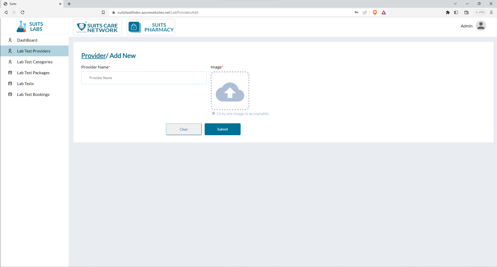
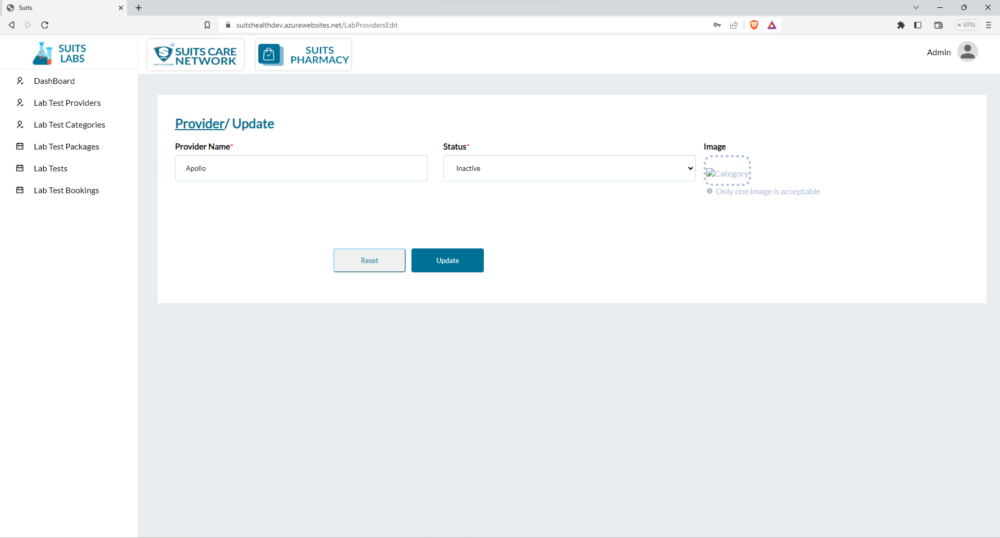
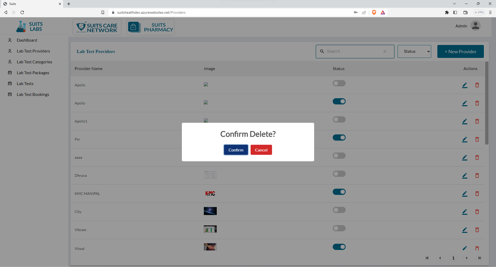

# Lab Test Provider Management

## Lab Test Provider List

The website will showcase a list of lab test providers, including their provider name, associated image, and status.

The admin has the capability to search for specific lab test providers by entering the provider name into the search function. This search functionality enables the admin to quickly locate and access the desired lab test provider within the list.

Moreover, the admin can filter the lab test providers based on their status, which can be classified as "Active" or "Inactive." By selecting the respective filter option, the admin can refine the displayed list to show only the lab test providers that match the chosen status. This filtering feature aids in organizing and managing lab test providers based on their availability or operational status.

By leveraging the search and filter options, the admin can efficiently navigate and interact with the list of lab test providers, making it easier to find specific providers and perform relevant administrative tasks as necessary.

## Add New Lab Test Provider

The admin has the ability to add a new lab test provider to the system. To do so, the admin will be required to provide the following details:

- Provider Name: The admin needs to enter the name or title of the lab test provider. This could be the official name of the provider or any other identifiable name.

- Image: The admin will need to upload an image or logo associated with the lab test provider. This image could represent the provider's branding or serve as a visual identifier.

By providing these details, the admin can successfully add a new lab test provider to the system. Once added, the provider will become part of the list of lab test providers and be displayed alongside other existing providers.

Adding new providers allows the admin to expand the available options for users, ensuring a comprehensive and up-to-date selection of lab test providers within the system.

## View/Update Lab Test Provider

To update provider details, the admin needs to provide the provider name and image:

1. Locate the specific lab test provider within the list that requires an update.
2. Click on the provider's name or an "Edit" button/icon associated with that provider.
3. This action will take the admin to a page or form where they can modify the provider's details.
4. In the form, find the field for the provider name and update it with the desired changes.
5. If there is an option to update the provider's image, the admin can either upload a new image or select a new image from a provided set of choices.
6. Once the necessary changes have been made, save the updated details by clicking the "Save" or "Update" button.

By following these steps, the admin can successfully update the provider details, including the provider name and image. It ensures that the information accurately reflects any modifications or changes related to the lab test provider.

## Delete Lab Test Provider

The admin has the ability to delete a lab test provider by using the delete icon associated with that provider.

To delete a lab test provider, the admin should follow these steps:

1. Locate the specific lab test provider within the list that needs to be deleted.
2. Identify the delete icon associated with that provider.
3. Click on the delete icon, triggering a confirmation prompt or dialog box to ensure the deletion is intentional.
4. Confirm the deletion when prompted to proceed with removing the lab test provider from the system.
5. Once confirmed, the lab test provider, along with any associated data or records, will be permanently deleted from the system.

It is essential to exercise caution when deleting a lab test provider, as the process is usually irreversible. Ensure that the deletion is intended and that any necessary backups or precautions have been taken.

By utilizing the delete icon, the admin can effectively manage the lab test providers list by removing providers that are no longer relevant, active, or required within the system.

