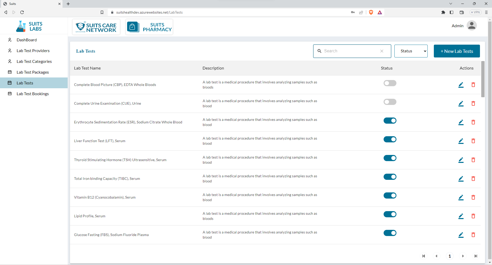
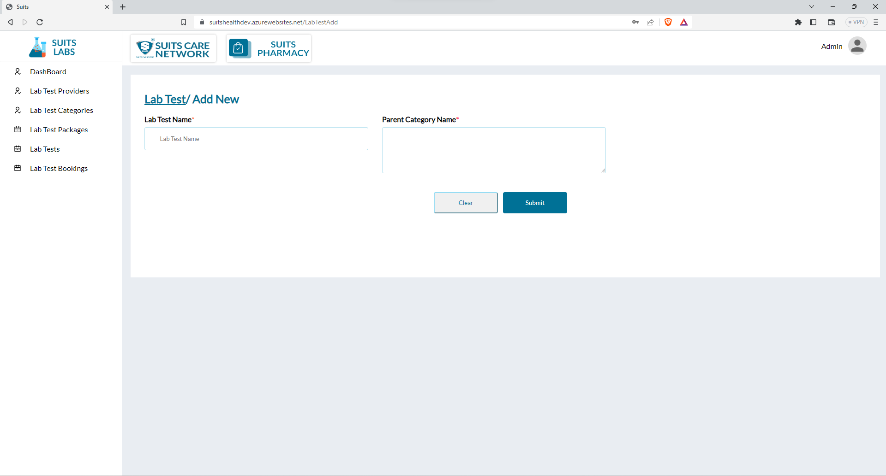
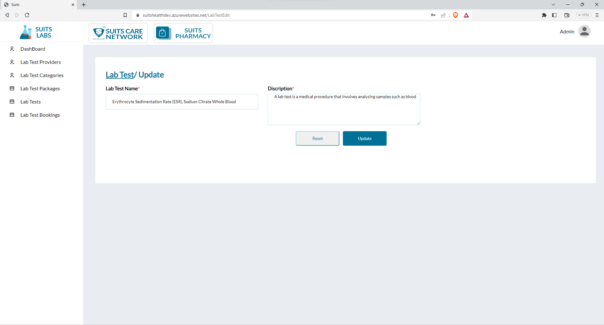
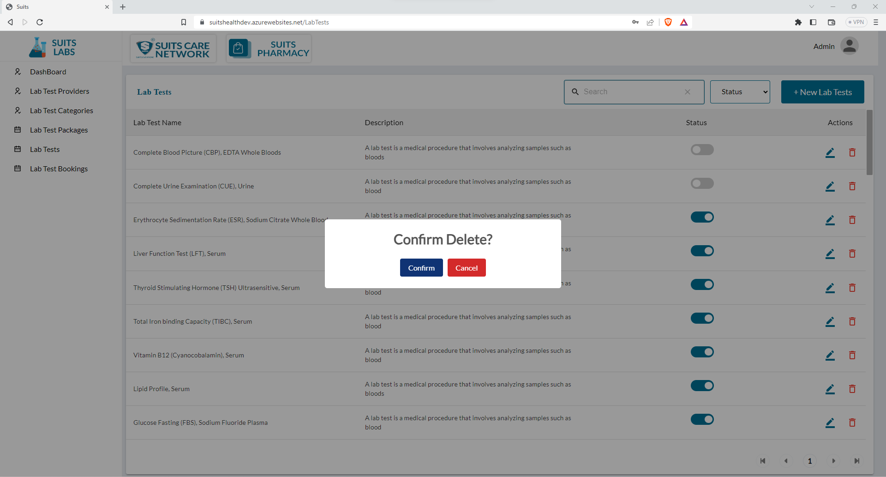

# Lab Tests Management

## Lab Tests

The admin has the option to view the lab test details on a separate page, where they can access information such as the lab test name, description, and status.

On the lab test details page, the admin can search for a specific lab test by entering the lab test name into the search function. This search functionality allows the admin to quickly locate and access the desired lab test within the list.

Additionally, the admin can filter the lab tests based on their status, which can be classified as "Active" or "Inactive." By selecting the respective filter option, the admin can refine the displayed lab tests to show only those that match the chosen status. This filtering feature helps in organizing and managing lab tests based on their availability or operational status.

By utilizing the search and filter options, the admin can efficiently navigate and explore the lab test details, making it easier to find specific lab tests and analyze their descriptions and statuses. This allows for effective lab test management and decision-making processes.

## Add New Lab Tests

Certainly! To add a new lab test, the admin needs to provide the lab test name and description. Here's how the admin can add a new lab test:

1. Access the lab test management section or the "Add New Lab Test" page.
2. Locate the form or fields where the lab test details can be entered.
3. Enter the lab test name in the designated field. Provide a unique and descriptive name for the lab test.
4. In the description field, provide relevant information about the lab test, such as its purpose, methodology, or any other details that would be useful for users.
5. Once the lab test name and description have been entered, save the new lab test by clicking the "Save" or "Add Lab Test" button.

By following these steps, the admin can successfully add a new lab test by entering the lab test name and description. This allows for the inclusion of new lab tests into the system, making them available for users to select and request when necessary.

## View/Update Lab Tests

Certainly! The admin has the ability to update lab tests by entering the lab test name and description. Here's how the admin can perform this update:

1. Access the lab test management section or the specific lab test details page.
2. Locate the lab test that requires updating.
3. Click on the lab test name or an "Edit" icon associated with that lab test.
4. This action will take the admin to a page or form where they can modify the lab test details.
5. In the form, find the field for the lab test name and update it with the desired changes.
6. Locate the field for the lab test description and modify it accordingly.
7. Once the necessary changes have been made, save the updated details by clicking the "Save" or "Update" button.

By following these steps, the admin can successfully update the lab test by entering the lab test name and description. This ensures that the lab test details accurately reflect any modifications or changes made to the lab test's name or description.

## Delete Lab Tests

The admin has the ability to delete any lab test by clicking on the delete icon associated with that specific lab test.

To delete a lab test, the admin can follow these steps:

1. Locate the lab test within the list that needs to be deleted.
2. Identify the delete icon linked to that lab test.
3. Click on the delete icon, which will trigger a confirmation prompt or dialog box to ensure the deletion is intentional.
4. Confirm the deletion when prompted to proceed with removing the lab test from the system.
5. Once confirmed, the lab test will be permanently deleted from the system, along with any associated data or records.

Please exercise caution when deleting a lab test, as the process is typically irreversible. Ensure that the deletion is intended and that any necessary backups or precautions have been taken.

By utilizing the delete icon, the admin can effectively manage the lab tests by removing tests that are no longer relevant, required, or appropriate within the system.

